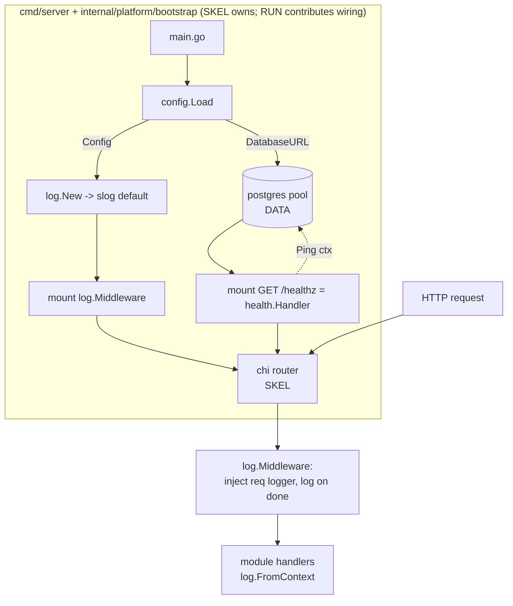

# Config & Runtime Design

**Spec**: `.specs/features/M0-foundation/config-runtime/spec.md`
**Status**: Draft

---

## Architecture Overview

This is a **platform / infrastructure** feature under `internal/platform/*` — technical
cross-cutting code with **no business rules and no bounded context**. It introduces three small,
single-purpose packages and contributes wiring to the composition root:

- `internal/platform/config` — parse the environment into one immutable typed `Config`; fail-fast
  aggregated validation. The single env-parsing site for the whole binary.
- `internal/platform/log` — build a configured `*slog.Logger`; request-logging middleware +
  context accessors.
- `internal/platform/health` — `GET /healthz` handler that pings the DB through a small
  consumer-owned `Pinger` port.

Config is loaded once at boot and **injected** into every consumer (no globals). The logger is
set as the `slog` default and also flows per-request through context. Health depends only on an
interface the pgx pool already satisfies.



**Failure to `config.Load` aborts startup** (logged, non-zero exit) — the listener never opens.

---

## Module(s), Clean Architecture Layers & DDD

- **Module(s):** none. These are `internal/platform/*` packages (shared technical infra), not a
  bounded context. Consumed by every module and by other platform packages via constructor
  injection.
- **Clean Architecture layers:** N/A within a module — platform infra sits *outside* the
  domain/app/adapter/public layering. It provides the wiring the outer (`adapter`) layer and the
  composition root use. The domain layer never imports these packages.
- **DDD building blocks:** **N/A** — no entities, value objects, aggregates, domain services,
  domain events, or repositories. This feature deliberately holds **no business rules**
  (per boundary note). `Config` is a plain settings struct, not a domain VO.

### Module boundary statement

The non-negotiable module-boundary rule ("no module imports another module's `domain`/`app`;
cross-module access only via `public/`") governs `internal/modules/*`. It does **not** restrict
`internal/platform/*`, which is importable shared infrastructure by design. Even so, we keep
interfaces small and consumer-shaped (ISP): `health.Pinger` exposes only `Ping`, not a DB API.

**Seam with M1 `system-configuration` (CFG):** runtime config (RUN) and business config (CFG)
are distinct. The M1 CFG store is a DB-backed business feature; it will obtain its pgx pool /
`DATABASE_URL` from **this** runtime config. Nothing here reads or defines business rules
(limits, booking window, deadlines, hold TTL, overbooking).

---

## Code Reuse Analysis

### Existing Components to Leverage

| Component | Location | How to Use |
| --------- | -------- | ---------- |
| pgx pool (`*pgxpool.Pool`) | `internal/platform/postgres` (DATA) | Satisfies `health.Pinger` directly (`Ping(ctx) error`); receives `DATABASE_URL` from `config` |
| testcontainer Postgres helper | `internal/platform/postgres` testutil (DATA) | Real-DB readiness + wiring integration tests |
| chi router + `middleware.RequestID`/`GetReqID` | `internal/platform/httpx` (SKEL) | Router mounts `log.Middleware` + `/healthz`; middleware reads the request id chi already set |
| Composition root | `internal/platform/bootstrap` (SKEL) | RUN adds config-load → logger → middleware → `/healthz` wiring steps |
| stdlib `log/slog` | Go 1.22 stdlib | Logger + handlers (no third-party logging lib) |

### Integration Points

| System | Integration Method |
| ------ | ------------------ |
| DATA `postgres` | `config` produces `DatabaseURL`; `health` pings the pool via `Pinger` |
| SKEL `httpx`/`bootstrap` | Mounts `log.Middleware` and the `/healthz` route; provides recovery/session/shutdown |
| M1 identity/auth | Consumes `Config.SessionSecret` for cookie signing (injected) |
| M1 CFG store | Consumes the pgx pool / `DATABASE_URL` sourced here (seam only) |

---

## Components

### config

- **Purpose**: Parse + validate the environment into one immutable typed `Config`.
- **Location**: `internal/platform/config/config.go`, `internal/platform/config/load.go`
- **Interfaces**:
  - `Load() (Config, error)` — convenience wrapper: `LoadFrom(os.Getenv)`.
  - `LoadFrom(getenv func(string) string) (Config, error)` — testable; reads all keys, applies
    defaults, aggregates validation errors, wraps `ErrInvalidConfig`.
  - `var ErrInvalidConfig = errors.New("invalid runtime configuration")`
  - Types (see Data Models): `Config`, `HTTPConfig`, `LogConfig`, `Environment`, `LogFormat`.
- **Dependencies**: stdlib only (`os`, `strconv`, `time`, `log/slog`, `errors`, `fmt`).
- **Reuses**: nothing (leaf package; imports no other project package → no import cycles).

### log

- **Purpose**: Build the app logger and log every request with correlation.
- **Location**: `internal/platform/log/logger.go`, `middleware.go`, `context.go`
- **Interfaces**:
  - `New(cfg config.LogConfig) *slog.Logger` — text or json handler at the configured level,
    writing to stderr.
  - `Middleware(logger *slog.Logger) func(http.Handler) http.Handler` — wraps the response writer
    to capture status/bytes; injects a request-scoped logger into the context; on completion emits
    one record `{method, path, status, bytes, duration_ms, request_id?}`.
  - `FromContext(ctx context.Context) *slog.Logger` — request logger or `slog.Default()`.
  - `IntoContext(ctx context.Context, l *slog.Logger) context.Context`
- **Dependencies**: stdlib (`log/slog`, `net/http`, `context`, `time`), `config` (for
  `LogConfig`), chi `middleware.GetReqID` (read-only request id).
- **Reuses**: chi request id set by SKEL; stdlib slog handlers.

### health

- **Purpose**: Liveness + DB-readiness probe at `GET /healthz`.
- **Location**: `internal/platform/health/health.go`
- **Interfaces**:
  - `type Pinger interface { Ping(ctx context.Context) error }` — consumer-owned port.
  - `Handler(p Pinger) http.HandlerFunc` — pings with a bounded timeout; 200 `{status:ok,db:ok}`
    on success, 503 `{status:degraded,db:down}` on error; never panics.
- **Dependencies**: stdlib (`net/http`, `context`, `time`, `encoding/json`).
- **Reuses**: `*pgxpool.Pool` (DATA) satisfies `Pinger` with no adapter.

### bootstrap wiring (contribution)

- **Purpose**: Assemble config → logger → middleware → `/healthz` in the composition root.
- **Location**: `internal/platform/bootstrap/bootstrap.go` (additive; SKEL owns the file/router)
- **Interfaces**: internal wiring — `cfg, err := config.Load()` (abort on err); `logger := log.New(cfg.Log)`;
  `slog.SetDefault(logger)`; `router.Use(log.Middleware(logger))`; `router.Get("/healthz", health.Handler(pool))`.
- **Dependencies**: `config`, `log`, `health`, DATA pool, SKEL router.
- **Reuses**: SKEL bootstrap scaffolding.

---

## Data Models

**No Postgres schema and no migrations.** This feature stores nothing. `Config` is env-sourced;
`/healthz` only pings the existing pool. (Contrast: M1 CFG will introduce a config table — out of
scope here.) The in-memory config types:

```go
// internal/platform/config
type Environment string
const (
    EnvDevelopment Environment = "development"
    EnvStaging     Environment = "staging"
    EnvProduction  Environment = "production"
)

type LogFormat string
const ( LogText LogFormat = "text"; LogJSON LogFormat = "json" )

type LogConfig struct {
    Level  slog.Level // LOG_LEVEL: debug|info|warn|error (default info)
    Format LogFormat  // LOG_FORMAT: text|json (default text in dev, else json)
}

type HTTPConfig struct {
    Port            int           // HTTP_PORT (default 8080, 1..65535)
    ReadTimeout     time.Duration // HTTP_READ_TIMEOUT (default 15s)
    WriteTimeout    time.Duration // HTTP_WRITE_TIMEOUT (default 15s)
    IdleTimeout     time.Duration // HTTP_IDLE_TIMEOUT (default 60s)
    ShutdownTimeout time.Duration // HTTP_SHUTDOWN_TIMEOUT (default 10s) — consumed by SKEL shutdown
}

type Config struct {
    Env           Environment // APP_ENV (default development)
    HTTP          HTTPConfig
    DatabaseURL   string      // DATABASE_URL (required) — consumed by DATA pool
    SessionSecret string      // SESSION_SECRET (required, >= 32 chars) — consumed by M1 auth
    Log           LogConfig
}
```

**Env variable → field map** (also the `.env.example` contract):

| Env var | Field | Required | Default | Validation |
| ------- | ----- | -------- | ------- | ---------- |
| `APP_ENV` | `Env` | no | development | one of development/staging/production |
| `HTTP_PORT` | `HTTP.Port` | no | 8080 | integer 1..65535 |
| `HTTP_READ_TIMEOUT` | `HTTP.ReadTimeout` | no | 15s | Go duration |
| `HTTP_WRITE_TIMEOUT` | `HTTP.WriteTimeout` | no | 15s | Go duration |
| `HTTP_IDLE_TIMEOUT` | `HTTP.IdleTimeout` | no | 60s | Go duration |
| `HTTP_SHUTDOWN_TIMEOUT` | `HTTP.ShutdownTimeout` | no | 10s | Go duration |
| `DATABASE_URL` | `DatabaseURL` | **yes** | — | non-empty, parseable URL |
| `SESSION_SECRET` | `SessionSecret` | **yes** | — | length >= 32 |
| `LOG_LEVEL` | `Log.Level` | no | info | debug/info/warn/error |
| `LOG_FORMAT` | `Log.Format` | no | text(dev)/json | text/json |

---

## Error Handling Strategy

| Error Scenario | Handling | User/Operator Impact |
| -------------- | -------- | -------------------- |
| Missing/invalid required env var(s) | `LoadFrom` aggregates all issues into one error wrapping `ErrInvalidConfig`; bootstrap logs it and `os.Exit(1)` | Process refuses to start; message names every offending var + accepted values |
| Malformed `DATABASE_URL` | Rejected at load (fail-fast) before any pool construction | Startup aborts with a clear message |
| DB ping fails / times out at `/healthz` | Handler returns 503 with `{status:degraded,db:down}`, logged at warn; bounded ctx timeout | Probe fails fast; orchestrator stops routing traffic |
| Request id absent | Middleware omits `request_id`, still emits the record | Log line present without correlation id |
| Panic inside a handler | Recovery middleware (**SKEL**, not this feature) converts to 500; `log.Middleware` still records the completed request | 500 response; incident captured |
| Logger construction | Never fails — defaults guarantee a valid handler | Always have a logger |
| Secrets in logs | Middleware/handlers never log `SESSION_SECRET` or `DATABASE_URL` credentials | LGPD / secret hygiene preserved |

Go conventions: errors wrapped with `fmt.Errorf("...: %w", err)`; sentinel `ErrInvalidConfig` in
`config`; `ctx context.Context` first param on `Ping`; no panics for control flow.

---

## Tech Decisions (only non-obvious ones)

| Decision | Choice | Rationale |
| -------- | ------ | --------- |
| Config source | All `os.Getenv` reads live only in `config.Load`; value injected everywhere | Fail-fast, testable, no global mutable state; avoids scattered env reads |
| Validation mode | Aggregated fail-fast (report all offending vars at once) | Better operator DX than fail-on-first |
| `.env` loading | No godotenv dependency; `.env.example` is a template dev tooling sources | KISS/YAGNI; prod uses real env |
| Health endpoint | Single `/healthz` = liveness + DB readiness, 503 on DB down | Matches scope; split `/readyz` trivial later |
| Health decoupling | Consumer-owned `Pinger` port (not importing pgx in `health`) | ISP/DIP; pool satisfies it directly, no adapter |
| Request id | Read chi `middleware.GetReqID` rather than generate | Reuse SKEL's chi middleware; avoids depending on `internal/shared/id` (may not exist yet in M0) |
| Logging lib | stdlib `log/slog` | Go 1.22 stdlib; no third-party dep (PROJECT.md stack) |
| Logger injection | Set `slog.SetDefault` at boot **and** pass a request logger via context | Package-level convenience + per-request correlation |
| Testability | `LoadFrom(getenv)` seam for config; in-memory slog handler + `httptest` for middleware/health | Deterministic unit tests, no I/O (matches "inject the clock" convention) |
