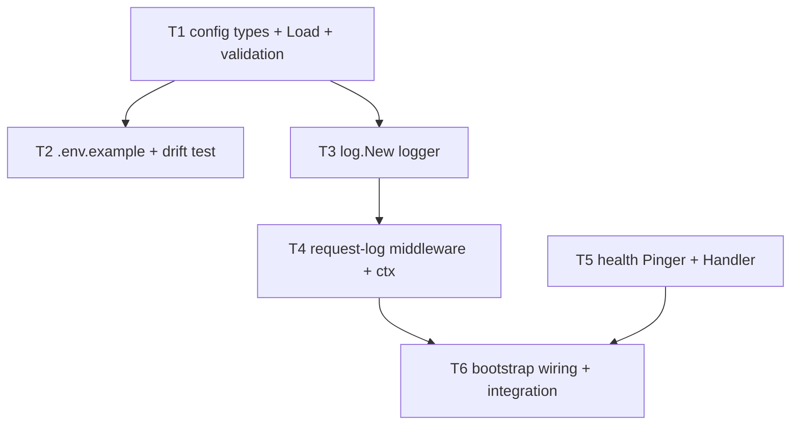

# Config & Runtime Tasks

**Design**: `.specs/features/M0-foundation/config-runtime/design.md`
**Status**: Draft

---

## Execution Plan



- **Phase 1 (parallel):** T1 `[P]`, T5 `[P]` — no dependencies, unit-only, parallel-safe.
- **Phase 2 (parallel):** T2 `[P]`, T3 `[P]` — both depend on T1, unit-only.
- **Phase 3:** T4 `[P]` — depends on T3, unit-only (alone in phase).
- **Phase 4 (sequential):** T6 — integration (real Postgres), not parallel-safe.

---

## Task Breakdown

### T1: config types + Load + validation + defaults

**What**: Define `Config`/`HTTPConfig`/`LogConfig`/`Environment`/`LogFormat` and
`Load`/`LoadFrom` with aggregated fail-fast validation and documented defaults.
**Where**: `internal/platform/config/config.go`, `internal/platform/config/load.go`,
`internal/platform/config/load_test.go`
**Depends on**: None
**Reuses**: stdlib only (`os`, `strconv`, `time`, `log/slog`, `errors`, `fmt`)
**Requirement**: RUN-01, RUN-02, RUN-03, RUN-04, RUN-05

**Tools**:

- MCP: NONE
- Skill: NONE

**Done when**:

- [ ] `Config` and nested types match the design's Data Models exactly.
- [ ] `LoadFrom(getenv)` applies all defaults and parses every var in the env→field map.
- [ ] Missing `DATABASE_URL`/`SESSION_SECRET` → one aggregated error (both named) wrapping
      `ErrInvalidConfig`; no partial config returned.
- [ ] `SESSION_SECRET` < 32 chars, bad `HTTP_PORT`, unknown `LOG_LEVEL`/`LOG_FORMAT`/`APP_ENV`
      each produce a validation error naming the var.
- [ ] `Load()` delegates to `LoadFrom(os.Getenv)`.
- [ ] Gate check passes: `go build ./... && go vet ./... && go test ./...`
- [ ] Test count: 8 unit tests pass (valid load w/ defaults; each required-missing; aggregated
      both-missing; short secret; bad port; bad level/format) — no silent deletions.

**Tests**: unit (config is `internal/platform/*` but pure — "unit where pure" per matrix)
**Gate**: quick

**Verify**: `go test ./internal/platform/config/...` → all pass; a table case with an empty env
returns an error naming both `DATABASE_URL` and `SESSION_SECRET`.

**Commit**: `feat(platform): typed runtime config with fail-fast validation`

---

### T2: `.env.example` + drift-guard test [P]

**What**: Add repo-root `.env.example` documenting every var (placeholders + comments) and a test
asserting every required key the loader reads is present.
**Where**: `.env.example`, `internal/platform/config/env_example_test.go`
**Depends on**: T1
**Reuses**: env→field map from T1 / design
**Requirement**: RUN-06

**Tools**:

- MCP: NONE
- Skill: NONE

**Done when**:

- [ ] `.env.example` lists all 10 vars from the env→field map with placeholder values + comments.
- [ ] Drift test parses `.env.example` keys and fails if any required var (`DATABASE_URL`,
      `SESSION_SECRET`) or any other mapped key is absent.
- [ ] Placeholder values for required keys satisfy `LoadFrom` (secret >= 32 chars).
- [ ] Gate check passes: `go build ./... && go vet ./... && go test ./...`
- [ ] Test count: 1 unit test passes (drift guard) — no silent deletions.

**Tests**: unit (static file + pure parsing test)
**Gate**: quick

**Verify**: `go test ./internal/platform/config/...` → drift test green; deleting a key from
`.env.example` makes it fail.

**Commit**: `chore(platform): .env.example with drift guard`

---

### T3: log.New logger constructor [P]

**What**: `New(cfg config.LogConfig) *slog.Logger` producing a json or text handler at the
configured level, to stderr.
**Where**: `internal/platform/log/logger.go`, `internal/platform/log/logger_test.go`
**Depends on**: T1
**Reuses**: stdlib `log/slog`; `config.LogConfig`
**Requirement**: RUN-07

**Tools**:

- MCP: NONE
- Skill: NONE

**Done when**:

- [ ] `LogJSON` → JSON handler, `LogText` → text handler; `Level` respected (a debug record is
      dropped at info level).
- [ ] Tests capture output via a `bytes.Buffer`-backed handler / writer (no real I/O).
- [ ] Gate check passes: `go build ./... && go vet ./... && go test ./...`
- [ ] Test count: 3 unit tests pass (json format, text format, level filtering) — no silent
      deletions.

**Tests**: unit (pure constructor — "unit where pure" per matrix)
**Gate**: quick

**Verify**: `go test ./internal/platform/log/...` → format/level tests green.

**Commit**: `feat(platform): slog logger constructor`

---

### T4: request-logging middleware + context accessors [P]

**What**: `Middleware(logger)` emitting one record per completed request, plus
`FromContext`/`IntoContext`.
**Where**: `internal/platform/log/middleware.go`, `internal/platform/log/context.go`,
`internal/platform/log/middleware_test.go`
**Depends on**: T3
**Reuses**: chi `middleware.GetReqID` (read-only); `httptest`; in-memory slog handler
**Requirement**: RUN-08, RUN-09

**Tools**:

- MCP: NONE
- Skill: NONE

**Done when**:

- [ ] Middleware wraps the `ResponseWriter` to capture status + bytes; emits exactly one record
      with method, path, status, bytes, duration_ms.
- [ ] Request id from chi is included when present, omitted when absent (both cases tested).
- [ ] `FromContext` returns the injected request logger inside a handler, and `slog.Default()`
      when none was injected.
- [ ] No secret values logged.
- [ ] Gate check passes: `go build ./... && go vet ./... && go test ./...`
- [ ] Test count: 4 unit tests pass (record fields; with request id; without request id;
      FromContext fallback) — no silent deletions.

**Tests**: unit (httptest, no DB — "unit where pure" per matrix middleware carve-out)
**Gate**: quick

**Verify**: `go test ./internal/platform/log/...` → drive one `httptest` request; assert a single
JSON record with expected keys.

**Commit**: `feat(platform): request-logging middleware with context logger`

---

### T5: health Pinger port + Handler [P]

**What**: `Pinger` port and `Handler(p Pinger) http.HandlerFunc` for `GET /healthz` (200 on ping
ok, 503 on ping error, bounded timeout).
**Where**: `internal/platform/health/health.go`, `internal/platform/health/health_test.go`
**Depends on**: None
**Reuses**: stdlib (`net/http`, `context`, `time`, `encoding/json`)
**Requirement**: RUN-10, RUN-11

**Tools**:

- MCP: NONE
- Skill: NONE

**Done when**:

- [ ] `Pinger` interface exposes only `Ping(ctx) error`.
- [ ] Fake pinger returning nil → 200 + `{status:ok,db:ok}`; returning error → 503 +
      `{status:degraded,db:down}`; handler never panics.
- [ ] Ping uses a bounded `context.WithTimeout`; a fake that blocks past the timeout → 503.
- [ ] Gate check passes: `go build ./... && go vet ./... && go test ./...`
- [ ] Test count: 3 unit tests pass (ok, error, timeout) — no silent deletions.

**Tests**: unit (pure handler with fake Pinger — "unit where pure" per matrix)
**Gate**: quick

**Verify**: `go test ./internal/platform/health/...` → 200/503/timeout branches green.

**Commit**: `feat(platform): /healthz handler with DB readiness pinger`

---

### T6: bootstrap wiring + integration test

**What**: Wire `config.Load` → `log.New`/`slog.SetDefault` → mount `log.Middleware` → mount
`GET /healthz = health.Handler(pool)` in the composition root; integration test against a real
Postgres testcontainer proving readiness + request logging + config-abort.
**Where**: `internal/platform/bootstrap/bootstrap.go` (additive wiring),
`internal/platform/bootstrap/bootstrap_test.go` (`//go:build integration`)
**Depends on**: T4, T5 (+ DATA postgres pool + testcontainer helper; SKEL bootstrap/httpx router)
**Reuses**: DATA `postgres` pool + testcontainer helper; SKEL router; `config`, `log`, `health`
**Requirement**: RUN-08, RUN-11, RUN-12

**Tools**:

- MCP: NONE
- Skill: NONE

**Done when**:

- [ ] Bootstrap loads config first; a missing required var aborts startup (error surfaced, no
      listener opened) — asserted in-test.
- [ ] Against a live Postgres testcontainer, `GET /healthz` → 200 (real `*pgxpool.Pool` satisfies
      `health.Pinger`); with the pool closed/unreachable → 503.
- [ ] A request through the assembled router emits one structured request-log record (captured
      via an injected slog handler).
- [ ] Gate check passes: `go test -tags=integration ./...`
- [ ] Test count: 3 integration tests pass (healthz 200 readiness; healthz 503 db-down; config
      abort) — no silent deletions.

**Tests**: integration (real Postgres; platform wiring per matrix)
**Gate**: full

**Verify**: `go test -tags=integration ./internal/platform/bootstrap/...` → all green;
`curl -s localhost:$HTTP_PORT/healthz` returns 200 against a running DB.

**Commit**: `feat(platform): wire config, logging middleware, and /healthz into bootstrap`

---

## Parallel Execution Map

```
Phase 1 (parallel):  T1 [P]   T5 [P]
Phase 2 (parallel):  T2 [P]   T3 [P]        (both need T1)
Phase 3:             T4 [P]                  (needs T3)
Phase 4 (sequential):T6                      (needs T4, T5; integration → serial)
```

**Parallelism constraint:** every `[P]` task above is unit-only and touches a distinct package
(no shared mutable state), so it is parallel-safe per TESTING.md. T6 is integration (shared
Postgres testcontainer) → never `[P]`.

---

## Task Granularity Check

| Task | Scope | Status |
| ---- | ----- | ------ |
| T1: config types + Load/validation | 1 package (types + loader, one cohesive concern) | ✅ Granular |
| T2: `.env.example` + drift test | 1 file + 1 test | ✅ Granular |
| T3: log.New | 1 function | ✅ Granular |
| T4: middleware + context accessors | 1 middleware + 2 tiny ctx helpers (cohesive) | ✅ Granular |
| T5: health Pinger + Handler | 1 endpoint handler + its port | ✅ Granular |
| T6: bootstrap wiring + integration | 1 wiring concern (composition root) | ✅ Granular |

---

## Diagram-Definition Cross-Check

| Task | Depends On (task body) | Diagram Shows | Status |
| ---- | ---------------------- | ------------- | ------ |
| T1 | None | (root) | ✅ Match |
| T2 | T1 | T1 → T2 | ✅ Match |
| T3 | T1 | T1 → T3 | ✅ Match |
| T4 | T3 | T3 → T4 | ✅ Match |
| T5 | None | (root) | ✅ Match |
| T6 | T4, T5 | T4 → T6, T5 → T6 | ✅ Match |

Parallel tasks share no dependency edges: T1↔T5 independent; T2↔T3 both depend only on T1
(not each other). ✅ Consistent.

---

## Test Co-location Validation

| Task | Code Layer Created/Modified | Matrix Requires | Task Says | Status |
| ---- | --------------------------- | --------------- | --------- | ------ |
| T1 | `internal/platform/config` (pure parsing) | integration (**unit where pure**) | unit | ✅ OK |
| T2 | static file + pure config test | unit (pure) | unit | ✅ OK |
| T3 | `internal/platform/log` constructor (pure) | integration (**unit where pure**) | unit | ✅ OK |
| T4 | `internal/platform/log` middleware (httptest, no I/O) | integration (**unit where pure**) | unit | ✅ OK |
| T5 | `internal/platform/health` handler (fake pinger, no I/O) | integration (**unit where pure**) | unit | ✅ OK |
| T6 | `internal/platform/bootstrap` wiring + real Postgres | integration | integration | ✅ OK |

**Notes:** T1–T5 invoke the matrix's explicit "(unit where pure)" carve-out for
`internal/platform/*` — each is deterministic with zero external I/O (env maps, `bytes.Buffer`,
`httptest`, fake `Pinger`). T6 exercises the real pgx pool against a testcontainer, so it is
integration and carries the real-DB readiness assertion (merge-forward of health's real-`Pinger`
proof into the earliest task where a live pool exists). No task defers its tests.
