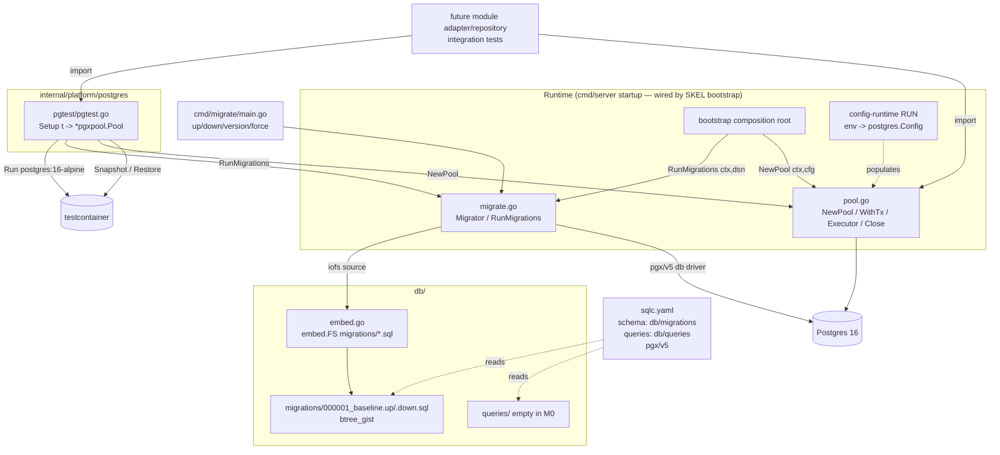

# Data & Migration Layer Design

**Spec**: `.specs/features/M0-foundation/data-migration/spec.md`
**Status**: Draft

---

## Architecture Overview

Technical cross-cutting infrastructure — **not a bounded-context module**, so the module-boundary
`public/` rule does not apply. These are shared platform packages under `internal/platform/postgres`
plus the `db/` migration/query stream. Every module's `adapter/repository` imports them (allowed by
ARCHITECTURE §3: `adapter` may import "infra libs (pgx, chi)"). Domain and app layers never touch them.

Three cooperating pieces:

1. **Pool** (`postgres.NewPool`, `postgres.WithTx`, `postgres.Executor`) — one verified `*pgxpool.Pool` + the ambient (ctx-carried) transaction boundary + the executor resolver.
2. **Migrator** (`postgres.Migrator`, `postgres.RunMigrations`) — golang-migrate over an embedded, ordered stream.
3. **Harness** (`pgtest.Setup`) — testcontainers-go Postgres 16 + migrations + per-test snapshot isolation.

---

## Code Reuse Analysis

Greenfield — no prior app code. Reuse is of external libraries (AD-005) and sibling-feature seams.

### Existing Components to Leverage

| Component | Location | How to Use |
| --------- | -------- | ---------- |
| `pgxpool` | `github.com/jackc/pgx/v5/pgxpool` | Pool construction, tuning, ping |
| `pgx` (Tx) | `github.com/jackc/pgx/v5` | `pgx.Tx` for `WithTx` |
| `pgx stdlib` | `github.com/jackc/pgx/v5/stdlib` | `*sql.DB` for golang-migrate driver + testcontainers `WithSQLDriver("pgx")` |
| golang-migrate | `github.com/golang-migrate/migrate/v4` + `source/iofs` + `database/pgx/v5` | Runner over embedded FS |
| testcontainers postgres | `github.com/testcontainers/testcontainers-go/modules/postgres` | `Run`, `Snapshot`, `Restore`, `ConnectionString`, `WithSQLDriver` |
| `embed` | stdlib | Embed migration SQL into the binary |

### Integration Points (sibling M0 features — authored in parallel)

| System | Integration Method |
| ------ | ------------------ |
| `config-runtime` (RUN) | RUN's env loader maps env → `postgres.Config` (struct defined here). We do NOT read env. |
| `project-skeleton` (SKEL) | SKEL owns `go.mod` + `internal/platform/bootstrap` + `cmd/server`. Bootstrap calls our `NewPool` and `RunMigrations`; each of our tasks adds its own module deps via `go get`. |
| All future module features | Import `internal/platform/postgres` (pool/tx) in `adapter/repository`; import `pgtest` in integration tests; add `sql` blocks to `sqlc.yaml` + queries to `db/queries/`. |

---

## Components

### postgres.Config + NewPool + WithTx + Executor

- **Purpose**: Construct one verified connection pool and provide the shared **ambient-transaction** boundary (the tx travels in `ctx`, never in a signature — see ARCHITECTURE §7 / M2 cross-module atomicity).
- **Location**: `internal/platform/postgres/pool.go`, `internal/platform/postgres/tx.go`
- **Interfaces** (Go-ish):
  - `type Config struct { DSN string; MaxConns int32; MinConns int32; MaxConnLifetime, MaxConnIdleTime, HealthCheckPeriod, ConnectTimeout time.Duration }`
  - `func NewPool(ctx context.Context, cfg Config) (*pgxpool.Pool, error)` — `pgxpool.ParseConfig(cfg.DSN)`, apply non-zero tuning (sane defaults for zeros), `pgxpool.NewWithConfig`, `Ping` within `ConnectTimeout`; wrap errors with `fmt.Errorf(...: %w)`.
  - `type Querier interface { Exec(...); Query(...); QueryRow(...) }` — the subset of `pgx` querier methods both `*pgxpool.Pool` and `pgx.Tx` satisfy.
  - `func WithTx(ctx context.Context, db *pgxpool.Pool, fn func(ctx context.Context) error) error` — `Begin`; store the `pgx.Tx` in the `ctx` passed to `fn`; on `fn` error → `Rollback` + return wrapped; on success → `Commit`; on panic → `Rollback` + re-panic. **The tx handle is never passed as an argument** — `fn` (and everything it calls, including other modules through their `public` ports) resolves it from `ctx`.
  - `func Executor(ctx context.Context, pool *pgxpool.Pool) Querier` — resolves the **ambient executor**: the `pgx.Tx` stored by `WithTx` if present in `ctx`, else `pool`. Every repository runs its queries through this, so a repository is transparently transaction-scoped when called inside `WithTx` and pool-scoped otherwise.
- **Dependencies**: `pgx/v5`, `pgxpool`. No app/domain deps.
- **Reuses**: pgxpool config parsing/tuning.

> **Why ambient (ctx-carried) and not `fn func(pgx.Tx)`:** in M2, `reservation-creation` opens the tx and calls `availability/public.Reserver.Reserve(ctx, …)` **inside it** so the occupancy increment and the reservation insert commit atomically (the last-vacancy guarantee, ARCHITECTURE §7). Availability's `public` package imports **stdlib only**, so a `pgx.Tx` can never appear in that cross-module signature — the tx **must** flow through `ctx`. Passing the handle to the callback would only work within a single module and would break the module-boundary rule cross-module.

### postgres.Migrator + RunMigrations

- **Purpose**: Apply/revert/inspect the embedded migration stream; expose the startup entry point.
- **Location**: `internal/platform/postgres/migrate.go`
- **Interfaces**:
  - `func NewMigrator(dsn string) (*Migrator, error)` — open `*sql.DB` via `pgx/v5/stdlib`; `iofs.New(db.MigrationsFS, db.MigrationsDir)`; `pgxv5.WithInstance(sqlDB, &pgxv5.Config{})`; `migrate.NewWithInstance("iofs", src, "pgx5", drv)`.
  - `func (m *Migrator) Up() error` — `m.Up()`; treat `migrate.ErrNoChange` as nil.
  - `func (m *Migrator) Down() error` / `func (m *Migrator) Steps(n int) error`
  - `func (m *Migrator) Version() (version uint, dirty bool, err error)` — `migrate.ErrNilVersion` → `(0,false,nil)`.
  - `func (m *Migrator) Force(v int) error` / `func (m *Migrator) Close() error`
  - `func RunMigrations(ctx context.Context, dsn string) error` — `NewMigrator` → `Up` → `Close`; returns error on failure or dirty state (fail-fast for bootstrap). `ctx` reserved for future cancellation; keeps signature stable for the composition root.
- **Dependencies**: golang-migrate (`migrate/v4`, `source/iofs`, `database/pgx/v5`), `pgx/v5/stdlib`, `db` package (embed).
- **Reuses**: golang-migrate stream management + `schema_migrations` bookkeeping.

### db (embedded migrations)

- **Purpose**: Own the `//go:embed` directive (embed paths cannot traverse `..`).
- **Location**: `db/embed.go` (package `db`), `db/migrations/000001_baseline.up.sql`, `.down.sql`
- **Interfaces**: `//go:embed migrations/*.sql` → `var MigrationsFS embed.FS`; `const MigrationsDir = "migrations"`.
- **Dependencies**: stdlib `embed`.

### pgtest.Setup (testcontainers harness)

- **Purpose**: Reusable per-package Postgres 16 + migrations + per-test isolated pool.
- **Location**: `internal/platform/postgres/pgtest/pgtest.go` (guarded `//go:build integration`)
- **Interfaces**:
  - `func Setup(t testing.TB) *pgxpool.Pool` — lazily (via `sync.Once`) `postgres.Run(ctx, "postgres:16-alpine", postgres.WithDatabase("campsite_test"), postgres.WithUsername("test"), postgres.WithPassword("test"), postgres.WithSQLDriver("pgx"))`; `RunMigrations` on its `ConnectionString`; `container.Snapshot(ctx)`. Per call: register `t.Cleanup(func(){ _ = container.Restore(ctx) })`, `NewPool` to the DB, register pool close; return pool. Container terminated via a package-level cleanup (TestMain or `sync.Once` + `t.Cleanup` on first setup). On any setup error → `t.Fatal`.
- **Dependencies**: testcontainers-go postgres module, `postgres.NewPool`, `postgres.RunMigrations`, `pgx/v5/stdlib` (blank import for `WithSQLDriver("pgx")`).
- **Reuses**: testcontainers `Snapshot`/`Restore` native isolation (falls back to `docker exec` without `WithSQLDriver` — we set pgx to keep it fast).

### sqlc.yaml

- **Purpose**: Configure type-safe codegen convention for downstream module queries.
- **Location**: `sqlc.yaml` (repo root); queries under `db/queries/` (empty in M0, `.gitkeep`).
- **Config**: `version: "2"`; one `sql` block (template/convention) with `engine: "postgresql"`,
  `schema: "db/migrations"`, `queries: "db/queries"`, `gen.go.sql_package: "pgx/v5"`,
  `emit_interface: true`, `emit_pointers_for_null_types: true`, per-module `package`/`out` filled by each module feature.
- **Note**: `sqlc generate` produces nothing until a module adds queries (documented, YAGNI).

### cmd/migrate

- **Purpose**: Dev/ops CLI for up/down/version/force outside startup.
- **Location**: `cmd/migrate/main.go`
- **Interfaces**: `migrate <up|down|version|force N>`; DSN from `-dsn` flag or `DATABASE_URL` env; delegates to `Migrator`; non-zero exit on error. A small `run(args, dsn) error` inner function is the integration-testable unit.
- **Dependencies**: `postgres.Migrator`.

---

## Data Models & Migration Conventions

No domain tables. The only managed objects in M0:

| Object | Migration | Direction |
| ------ | --------- | --------- |
| `btree_gist` extension | `000001_baseline` | up: `CREATE EXTENSION IF NOT EXISTS btree_gist;` / down: `DROP EXTENSION IF EXISTS btree_gist;` |
| `schema_migrations` table | (managed by golang-migrate) | auto |

**Migration conventions (the contract for every later feature):**

- Filename: `NNNNNN_name.up.sql` + `NNNNNN_name.down.sql`; `NNNNNN` = 6-digit zero-padded, gap-free, monotonically increasing; `name` = snake_case.
- One migration per schema change; **always reversible** (a real `.down.sql`, not a stub).
- Single stream, one database (STRUCTURE §Migrations): a migration is *conceptually* owned by the module whose tables it creates, but all files live in `db/migrations/`.
- Concurrency/locking SQL (`SELECT … FOR UPDATE`, `pg_advisory_xact_lock`) and overlap constraints (exclusion constraint + range type, requiring `btree_gist`) are **hand-written** in migrations / `db/queries/` by the owning feature — this feature only guarantees the extension and the `WithTx`/`Executor` boundary exist.

**Enabling ARCHITECTURE §7 (concurrency & consistency) — infra only, no rules here:**

- `WithTx` opens the boundary and stores the tx in `ctx`; `Executor(ctx, pool)` resolves it. Reservation-creation runs its lock (via `availability.Reserve`) **and** its insert inside the same `WithTx`, and availability's repository picks up the *same* tx from `ctx` via `Executor` — so the occupancy increment and the reservation insert commit atomically across the module boundary (compute-then-insert holds the lock). This ambient seam is what makes the last-vacancy guarantee work without the `pgx.Tx` ever crossing a `public` boundary.
- `btree_gist` lets reservations declare `EXCLUDE USING gist (cpf WITH =, period WITH &&)`-style constraints on range types for cross-campsite overlap prevention (the DB is the final guarantee).
- The `pgtest` harness enables concurrent-goroutine tests (last-vacancy race → exactly one winner) against real committed transactions.

**DDD note:** This layer has **no entities, value objects, aggregates, domain services, events, or
repository interfaces** — it is technical infrastructure. Repository *interfaces* live in each
module's `domain`; their pgx/sqlc *implementations* (in `adapter/repository`) resolve their executor
via `Executor(ctx, pool)` and run inside `WithTx` when the caller opens one. We provide the
mechanism; domain semantics stay in the modules.

---

## Error Handling Strategy

| Error Scenario | Handling | Impact |
| -------------- | -------- | ------ |
| Invalid DSN / unreachable DB in `NewPool` | Wrap + return within `ConnectTimeout`; no panic | Bootstrap fails fast at startup |
| `fn` error/panic inside `WithTx` | Rollback; wrap error / re-panic after rollback | Transaction atomic; no partial commit |
| Migration apply failure | golang-migrate marks version **dirty**; `RunMigrations`/`Up` returns error | Startup aborts; `migrate force N` recovers |
| `Up` with nothing pending | `migrate.ErrNoChange` → treated as success (nil) | Idempotent startup |
| `Version` on empty DB | `migrate.ErrNilVersion` → `(0,false,nil)` | Clean "no migrations yet" signal |
| testcontainer start failure / no Docker | `t.Fatal` with clear message | Integration test fails loudly (CI has Docker) |
| Pool exhausted | pgxpool blocks on caller `ctx`; fails on deadline/cancel | No silent leak; caller controls timeout |

Convention (CONVENTIONS.md): return `error`, wrap with `%w`; sentinel comparisons via
`errors.Is`; no panics for control flow (the only re-panic is `WithTx` preserving a caller panic after rollback).

---

## Tech Decisions (non-obvious)

| Decision | Choice | Rationale |
| -------- | ------ | --------- |
| Migration source driver | golang-migrate `source/iofs` over `embed.FS` | Single-binary deploy; migrations shipped in the executable; same FS used by prod and harness (parity). |
| Migration DB driver | `database/pgx/v5` via `*sql.DB` (`pgx/v5/stdlib`) | Consistent with AD-005 pgx stack; `WithInstance` reuses an existing `*sql.DB`. |
| Migration instance API | `migrate.NewWithInstance("iofs", src, "pgx5", drv)` | Explicit driver instances; avoids DSN re-parsing quirks of URL constructors. |
| Embed location | `db/embed.go` (package `db`) | `//go:embed` cannot use `..`; must sit at/above `db/migrations`. |
| Per-test isolation | testcontainers `Snapshot` (post-migration) + `Restore` in `t.Cleanup` | Native, fast, supports real multi-connection concurrency tests (a wrapping-tx rollback cannot). |
| `WithSQLDriver("pgx")` | Set on `postgres.Run` | Snapshot/Restore uses the native driver instead of slow `docker exec` fallback. |
| Harness package (not `_test.go`) | `internal/platform/postgres/pgtest`, `//go:build integration` | Must be importable by other packages' integration tests; build tag keeps testcontainers out of the production binary. |
| Integration tests serial | No `[P]` on integration tasks | TESTING.md Parallelism Assessment: shared container ⇒ not parallel-safe; concurrency tests intentionally contend. |
| `postgres.Config` owned here | Provider-shaped struct populated by RUN | Pool stays unit-testable; RUN owns env parsing, we own pool-tuning shape. |
| Ambient tx (`WithTx` stores tx in `ctx`) + `Executor(ctx, pool)` | `fn func(ctx) error`, not `fn func(pgx.Tx) error`; repositories resolve the executor from `ctx` | ARCHITECTURE §7 / M2: `reservation-creation` must run `availability/public.Reserver.Reserve` and its own insert in **one** tx across the module boundary. Availability's `public` imports stdlib only, so the `pgx.Tx` cannot be an argument — it must travel in `ctx`. A `func(pgx.Tx)` callback would work only within a single module. |
| `btree_gist` in baseline | Enabled in `000001_baseline` | DB-wide, cross-feature prerequisite (no domain schema); readies §7 exclusion constraints without pre-designing tables. |
