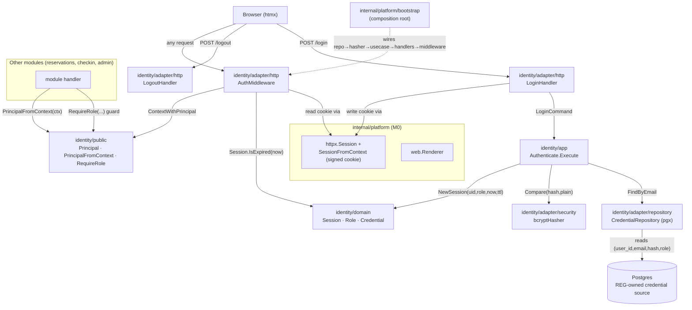

# Authentication Design

**Spec**: `.specs/features/M1-identity-setup/authentication/spec.md`
**Status**: Draft

---

## Architecture Overview

Authentication lives in the **`identity`** module and spans all four Clean Architecture layers plus
the module's `public/` contract. The rich domain owns three concepts — `Role` (VO/enum), `Session`
(entity enforcing the expiry invariant), and `Credential` (entity that verifies a password through
a `PasswordHasher` port). The app layer has one single-purpose use case, `Authenticate`. Adapters
provide the `bcrypt` hasher, the pgx credential reader (over REG-owned tables), the HTTP login/
logout handlers, and the **auth middleware** that maps a session cookie to a `public.Principal`.
The `public/` package is the only surface other modules touch: a flat `Principal` DTO, context
accessors, and the `RequireRole` authorization middleware.

Sessions are **signed cookies** (reusing the M0 `httpx` session seam over `gorilla/sessions`
`CookieStore`) — no server-side session table. The domain `Session` is serialized into the cookie
at login and re-materialized + expiry-checked by the middleware on every request.



**Dependency-rule check:** `domain` imports only stdlib + `internal/shared` (none needed here);
`app` imports own `domain` + own ports; `adapter` imports own `app`/`domain` + infra
(`gorilla/sessions` via `httpx`, `pgx`, `golang.org/x/crypto/bcrypt`); `public` imports stdlib
only (`context`, `net/http`) + its own flat DTOs. No other module's `domain`/`app` is imported by
anyone; cross-module access is exclusively `identity/public`.

---

## Modules & Clean Architecture Layers Touched

| Area | This feature does | Layer |
| ---- | ----------------- | ----- |
| `identity/domain` | **Adds** `Role` VO, `Session` entity, `Credential` behavior + `PasswordHasher`/`CredentialRepository` ports + sentinel errors | domain |
| `identity/app` | **Adds** `Authenticate` use case (+ command/result DTOs) | app |
| `identity/adapter/security` | **Adds** `bcrypt` implementation of `PasswordHasher` | adapter |
| `identity/adapter/repository` | **Adds** pgx `CredentialRepository` + one `sqlc` read query | adapter |
| `identity/adapter/http` | **Adds** login/logout handlers, `AuthMiddleware`, module `Mount` | adapter |
| `identity/public` | **Adds** `Principal` DTO, context accessors, `RequireRole` middleware, role string constants | public |
| `internal/platform/bootstrap` | **Contributes** identity wiring (repo→hasher→use case→handlers→middleware; mount) | platform (SKEL owns file) |
| `web/templates/identity` | **Adds** `login.html` partial | infra assets |
| `db/queries` | **Adds** `identity_credentials.sql` (read query only; no migration) | infra |

### Module Boundary Statement (ARCHITECTURE §2, non-negotiable)

- **Consumed cross-module contract exposed by this feature:** `identity/public`. Other modules
  (reservations, checkin, admin) depend on it for the actor + authorization and **never** import
  `identity/domain` or `identity/app`. Domain entities (`Session`, `Credential`, `Role`) never
  cross the boundary — they are mapped to the flat `Principal` DTO inside `identity/adapter/http`.
- **Intra-module reuse (allowed, not a boundary crossing):** REG and Authentication are **both**
  the `identity` module and share the `identity/domain` package. Auth reads credentials REG
  persists via the shared `CredentialRepository`; this is same-package reuse, not a cross-module
  import. Auth does **not** re-specify registration.
- **Consumed from platform (allowed):** `internal/platform/httpx` (session seam,
  `SessionFromContext`), `internal/platform/web` (renderer), `internal/platform/postgres`
  (`WithTx`/pool) — technical infra, importable by `adapter` per ARCHITECTURE §3.

---

## DDD Building Blocks

| Block | Type | Responsibility / Invariant |
| ----- | ---- | -------------------------- |
| `Role` | **Value Object (enum)** | One of `visitor` / `Porteiro` / `Administrator`; self-validating via `ParseRole`; compared by value. Unknown strings are unrepresentable. |
| `Email` | **Value Object** (owned by REG; **reused**) | Normalized + validated email. Auth reuses it as the `FindByEmail` key; does not redefine it. |
| `Session` | **Entity** | Identity = the authenticated actor for a browser session. Holds `UserID`, `Role`, `IssuedAt`, `ExpiresAt`. Invariant: `ExpiresAt = IssuedAt + TTL`; behavior `IsExpired(now)` is the single expiry authority. |
| `Credential` | **Entity** (shared with REG) | Holds `UserID`, `Email`, `PasswordHash`, `Role`. Behavior `VerifyPassword(plain, hasher)` returns `ErrInvalidCredentials` on mismatch — verification logic lives with the data, not in the use case. |
| `PasswordHasher` | **Domain port** | `Compare(hashed, plain) error` (used by auth) — implemented by the `bcrypt` adapter. Keeps `golang.org/x/crypto/bcrypt` out of the pure domain. (`Hash` is REG's side of the same port.) |
| `CredentialRepository` | **Repository (port)** | `FindByEmail(ctx, Email) (Credential, error)` → `ErrCredentialNotFound`. Interface in `domain`, pgx impl in `adapter/repository`. One collection-like accessor for the credential. |
| `Authenticate` | **Use case (app service)** | Orchestrates: load credential → verify password → mint `Session`. Single responsibility (SRP). |

**No domain events** are needed — login/logout produce no cross-module reactions in MVP (YAGNI).
**Ubiquitous language:** `Porteiro` is preserved PT-BR; `Administrator`/`visitor` map to
Administrador/Visitante.

---

## Public Interface(s) — the cross-module contract

Exposed in `internal/modules/identity/public/` (stdlib-only; flat DTOs). This is the surface M2–M5
consume.

```go
// principal.go — flat DTO + context transport (no domain types cross here)
type Principal struct {
    UserID        string // empty for anonymous
    Role          string // one of the RoleX constants below
    Authenticated bool
}

const (
    RoleVisitor       = "visitor"
    RolePorteiro      = "Porteiro"
    RoleAdministrator = "Administrator"
)

// Anonymous is the zero-value principal used when no valid session is present.
func Anonymous() Principal // { Role: RoleVisitor, Authenticated: false }

// Context transport — identity/adapter/http.AuthMiddleware writes; everyone reads.
func ContextWithPrincipal(ctx context.Context, p Principal) context.Context
func PrincipalFromContext(ctx context.Context) Principal // Anonymous() if unset

// authz.go — authorization middleware other modules wrap their routes with (ISP: only what a
// consumer needs to gate a route). Depends only on net/http + PrincipalFromContext.
func RequireRole(roles ...string) func(http.Handler) http.Handler
func RequireAuthenticated() func(http.Handler) http.Handler // == RequireRole(any authenticated)
```

`RequireRole` semantics: anonymous → `401` + `HX-Redirect: /login` (or 302 to `/login` on direct
navigation); authenticated but role not in `roles` → `403`; otherwise `next`.

**Port ownership:** `identity/public` is a **provider-defined** contract (the principal is
naturally owned by identity). `PasswordHasher`/`CredentialRepository` are ports the **app owns**
(dependency inversion, injected at the composition root). `health.Pinger`-style consumer ports are
not needed here.

### Consumed interfaces

| Consumed | From | Used by | How |
| -------- | ---- | ------- | --- |
| `httpx.SessionFromContext(ctx) *sessions.Session` | `internal/platform/httpx` (SKEL-07) | `AuthMiddleware`, login/logout handlers | Read/write the signed cookie session. |
| `Config.SessionSecret` | `internal/platform/config` (RUN) | composition root | Passed to `httpx.Session` for cookie signing. |
| `web.Renderer.Page` | `internal/platform/web` (SKEL) | login handler | Render `login.html` full/fragment. |
| `postgres` pool + `WithTx` | `internal/platform/postgres` (DATA) | `CredentialRepository` | Query the credential source. |
| `identity/domain.Email` | `identity/domain` (REG) | `Authenticate`, repository | `FindByEmail` key (intra-module reuse). |

---

## Data Models

**No new migration.** Authentication is read-only against the credential data that REG persists.
It contributes **one `sqlc` read query**, not a table.

**Consumed read contract** (owned by user-company-registration; see spec Open Decisions):

| Field | Type | Notes |
| ----- | ---- | ----- |
| `user_id` | `uuid` | Account identity (PF user or PJ company + legal responsible). |
| `email` | `citext`/`text` UNIQUE | Login key; unique across the credential source. |
| `password_hash` | `text` | `bcrypt` hash written by REG registration. |
| `role` | `text` | `visitor` \| `Porteiro` \| `Administrator`; defaults to `visitor` at registration. |

```sql
-- db/queries/identity_credentials.sql  (read-only; REG owns the schema/migration)
-- name: FindCredentialByEmail :one
SELECT user_id, email, password_hash, role
FROM   <credential_source>          -- REG-owned: a credentials table or PF/PJ union view
WHERE  email = $1;                   -- unique → at most one row
```

**In-cookie session (not a DB row):** `gorilla/sessions` values `{"uid": string, "role": string,
"exp": int64 (unix seconds)}`, signed with `SessionSecret`. `Session.ExpiresAt` → `exp`; cookie
`Options{MaxAge: int(ttl.Seconds()), HttpOnly: true, SameSite: Lax, Secure: !dev, Path: "/"}`.

**Domain shapes (Go-ish):**

```go
// identity/domain
type Role string
func ParseRole(s string) (Role, error)   // ErrInvalidRole on unknown
func (r Role) String() string

type Session struct { UserID string; Role Role; IssuedAt, ExpiresAt time.Time }
func NewSession(userID string, role Role, now time.Time, ttl time.Duration) (Session, error)
func (s Session) IsExpired(now time.Time) bool

type Credential struct { UserID string; Email Email; PasswordHash string; Role Role }
func (c Credential) VerifyPassword(plain string, h PasswordHasher) error // ErrInvalidCredentials

type PasswordHasher interface { Compare(hashed, plain string) error }
type CredentialRepository interface { FindByEmail(ctx context.Context, e Email) (Credential, error) }

var (
    ErrInvalidCredentials  = errors.New("identity: invalid credentials")
    ErrCredentialNotFound  = errors.New("identity: credential not found")
    ErrInvalidRole         = errors.New("identity: invalid role")
)

// identity/app
type LoginCommand struct { Email, Password string }
type AuthResult   struct { UserID, Role string; ExpiresAt time.Time }
type Authenticate struct { /* repo CredentialRepository; hasher PasswordHasher; now func() time.Time; ttl time.Duration */ }
func (a Authenticate) Execute(ctx context.Context, cmd LoginCommand) (AuthResult, error)
```

---

## Code Reuse Analysis

### Existing Components to Leverage

| Component | Location | How to Use |
| --------- | -------- | ---------- |
| Session seam (`Session` middleware, `SessionFromContext`) | `internal/platform/httpx` (SKEL-07) | Read/write signed cookie; the store is already wired behind the accessor. |
| `Config.SessionSecret` | `internal/platform/config` (RUN) | Cookie signing secret injected at bootstrap. |
| `Renderer.Page` (full vs `HX-Request` fragment) | `internal/platform/web` (SKEL) | Render the login page/fragment. |
| pgx pool + `WithTx` | `internal/platform/postgres` (DATA) | Credential read query. |
| `pgtest.Setup` (testcontainers PG 16) | `internal/platform/postgres/pgtest` (DATA) | Integration tests seed a credential row + exercise repo/handlers. |
| `bootstrap.Module` mount seam | `internal/platform/bootstrap` (SKEL-14) | identity `Mount(chi.Router)` plugs into the composition root. |
| `Email` VO | `identity/domain` (REG) | `FindByEmail` key — intra-module reuse. |

### Integration Points

| System | Integration Method |
| ------ | ------------------ |
| user-company-registration (REG) | Reads REG's credential source; shares `identity/domain` (`Email`, `Credential`, `Role`). Auth adds no registration logic. |
| reservations / checkin / admin (M2–M5) | Consume `identity/public.Principal` + `RequireRole`; mount their routes behind it at the composition root. |
| system-configuration (CFG, M1) | *Future*: session TTL may be sourced from CFG; today it is an injected default. |

### External dependencies (go.mod)

| Dependency | Purpose | Decision |
| ---------- | ------- | -------- |
| `golang.org/x/crypto/bcrypt` | Password hash comparison | AD-005 (bcrypt). Isolated in `adapter/security`. |
| `github.com/gorilla/sessions` (transitive via `httpx`) | Signed cookie store | Reused from SKEL; not imported directly by domain/app. |

---

## Components

### domain: Role, Session, Credential (+ ports)

- **Purpose**: Encapsulate authentication invariants (role validity, session expiry, password
  verification) as behavior-rich types.
- **Location**: `internal/modules/identity/domain/{role.go,session.go,credential.go,errors.go}`
- **Interfaces**: `ParseRole`, `Session.IsExpired`, `NewSession`, `Credential.VerifyPassword`,
  `PasswordHasher`, `CredentialRepository` (signatures above).
- **Dependencies**: stdlib (`time`, `errors`); `identity/domain.Email` (REG). No infra.
- **Reuses**: `Email` VO.

### app: Authenticate use case

- **Purpose**: Single-purpose login orchestration; maps not-found *and* mismatch to one
  `ErrInvalidCredentials` (no enumeration); mints a `Session` via the injected clock + TTL.
- **Location**: `internal/modules/identity/app/authenticate.go`
- **Interfaces**: `Execute(ctx, LoginCommand) (AuthResult, error)`.
- **Dependencies**: `CredentialRepository`, `PasswordHasher`, `func() time.Time`, `ttl`,
  `identity/domain`.
- **Reuses**: domain behavior — the use case holds no verification logic itself.

### adapter/security: bcryptHasher

- **Purpose**: Implement `PasswordHasher.Compare` with `bcrypt.CompareHashAndPassword`; perform a
  fixed dummy compare for not-found emails (timing mitigation) via an exported helper.
- **Location**: `internal/modules/identity/adapter/security/bcrypt.go`
- **Interfaces**: `NewBcryptHasher() PasswordHasher`; `Compare(hashed, plain) error` →
  `ErrInvalidCredentials` on `bcrypt.ErrMismatchedHashAndPassword`.
- **Dependencies**: `golang.org/x/crypto/bcrypt`, `identity/domain`.
- **Reuses**: n/a. Pure/CPU-only (no I/O) → unit-testable.

### adapter/repository: CredentialRepository (pgx)

- **Purpose**: Implement `FindByEmail` over the REG-owned credential source; map "no rows" →
  `ErrCredentialNotFound`.
- **Location**: `internal/modules/identity/adapter/repository/credential_repository.go` +
  `db/queries/identity_credentials.sql`
- **Interfaces**: `NewCredentialRepository(pool) domain.CredentialRepository`.
- **Dependencies**: pgx pool, generated `sqlc` query, `identity/domain`.
- **Reuses**: `internal/platform/postgres` pool.

### adapter/http: AuthMiddleware

- **Purpose**: On every request, read the session cookie, rebuild a `domain.Session`, drop it if
  `IsExpired(now)`, and write a `public.Principal` (authenticated or `Anonymous()`) into context.
- **Location**: `internal/modules/identity/adapter/http/auth_middleware.go`
- **Interfaces**: `AuthMiddleware(now func() time.Time) func(http.Handler) http.Handler`.
- **Dependencies**: `httpx.SessionFromContext`, `identity/domain`, `identity/public`.
- **Reuses**: httpx session seam; maps domain → `Principal` DTO here (boundary mapping).

### adapter/http: Login & Logout handlers

- **Purpose**: `GET/POST /login` (render form; authenticate; write cookie; redirect w/ safe
  `next`); `POST /logout` (expire cookie; redirect). Thin: decode → use case → render/redirect.
- **Location**: `internal/modules/identity/adapter/http/{login_handler.go,logout_handler.go}` +
  `web/templates/identity/login.html`
- **Interfaces**: `LoginHandler(uc Authenticate, rd *web.Renderer) http.Handler`,
  `LogoutHandler() http.HandlerFunc`.
- **Dependencies**: `Authenticate`, `web.Renderer`, `httpx` session, `identity/public` (role for
  cookie), `net/url` (safe redirect).
- **Reuses**: renderer; maps `ErrInvalidCredentials` → 200 re-render with generic message.

### adapter/http: identity Module (mount)

- **Purpose**: Implement `bootstrap.Module`: mount `AuthMiddleware` (module-scoped or global via
  bootstrap), `/login`, `/logout`; expose the module name.
- **Location**: `internal/modules/identity/adapter/http/module.go`
- **Interfaces**: `New(deps) *Module`; `Name() string`; `Mount(chi.Router)`.
- **Dependencies**: the handlers/middleware above.
- **Reuses**: `bootstrap.Module` seam.

### public: Principal, context accessors, RequireRole

- **Purpose**: The cross-module contract (DTO + authorization). Pure stdlib.
- **Location**: `internal/modules/identity/public/{principal.go,authz.go}`
- **Interfaces**: as listed in **Public Interface(s)** above.
- **Dependencies**: `context`, `net/http` (stdlib only).
- **Reuses**: n/a — intentionally standalone so any module can import it without pulling identity
  internals.

---

## Error Handling Strategy

| Error Scenario | Handling | User Impact |
| -------------- | -------- | ----------- |
| Unknown email / wrong password | Use case returns `ErrInvalidCredentials` (single path); handler re-renders login (200) with a generic message; a dummy `bcrypt` compare runs for unknown email | "Invalid email or password"; no field/enumeration leak |
| Empty email/password | Handler validates before any DB/`bcrypt` work → 200 re-render with field error | Inline validation message |
| Tampered/forged/absent cookie | `httpx.Session` yields a fresh session; middleware → `Anonymous()` | Treated as visitor; no error |
| Expired session | `Session.IsExpired(now)` true → middleware → `Anonymous()` | Silently signed out |
| `RequireRole`, anonymous | 302 `/login?next=…` (direct) or 401 + `HX-Redirect` (htmx) | Sent to login |
| `RequireRole`, wrong role | `403 Forbidden`, protected handler not called | Forbidden page/fragment |
| Malformed stored hash | `bcrypt` compare fails → `ErrInvalidCredentials` (never panics/authenticates) | Generic invalid-credentials |
| Repository DB error (not "no rows") | Wrapped (`fmt.Errorf("...: %w")`), surfaced as 500; not conflated with `ErrInvalidCredentials` | Generic error page |
| `ParseRole` on bad stored role | `ErrInvalidRole` → 500 (data integrity), logged; never silently downgrades to visitor | Generic error; alerted in logs |

Conventions (CONVENTIONS.md): sentinel/domain errors in `domain`; wrap with `%w`; `errors.Is` for
comparison; `ctx` first param; no panics for control flow; handlers map domain errors → HTTP.

---

## Tech Decisions (only non-obvious ones)

| Decision | Choice | Rationale |
| -------- | ------ | --------- |
| Session storage | Signed cookie via `gorilla/sessions` (reuse SKEL seam); **no DB session table** | AD-005 cookie sessions; KISS/YAGNI — expiry lives in the cookie + domain `Session`. |
| `Session` as a domain entity (not just cookie fields) | Expiry invariant (`ExpiresAt`, `IsExpired`) modeled in `domain`; cookie is its serialization | Rich domain; the middleware and use case share one expiry authority (DRY). |
| Password verification via `PasswordHasher` port | `bcrypt` in `adapter/security`, port in `domain` | Keeps `x/crypto/bcrypt` out of the pure domain (DIP); REG reuses the same port for `Hash`. |
| Not-found and mismatch → same `ErrInvalidCredentials` + dummy compare | Uniform failure + constant-ish cost | Prevents user enumeration (PRD §12 Segurança). |
| `RequireRole` in `public` (stdlib http) | Authorization middleware is the cross-module contract | Any module gates routes with one import; `public` stays infra-free (context + net/http only, allowed by ARCHITECTURE §3). |
| Principal in context, written by identity, read via `public` accessors | `ContextWithPrincipal`/`PrincipalFromContext` own the context key | Other modules never touch identity internals or the raw cookie (boundary safety). |
| Injected clock (`func() time.Time`) into use case + middleware | Deterministic expiry tests | CONVENTIONS.md "inject a clock". |
| Session TTL injected constant (default 24h) | Not CFG-backed yet | Avoids a cross-feature dependency in this slice; trivial later swap (spec Open Decision). |
| Logout = cookie expiry in the HTTP adapter | No `Logout` app use case | Cookie sessions have no server state to revoke; a use case would be YAGNI. |
| Credential read = one `sqlc` query, **no migration** | Auth is read-only over REG's schema | REG owns the table; auth adds only `FindCredentialByEmail`. |
| `bcryptHasher` tested as **unit** | Pure CPU, no I/O | Coverage matrix's intent (test where behavior is); no testcontainer needed. |

---

## Tips honored

- **Interfaces first**: `public.Principal`/`RequireRole`, `PasswordHasher`, `CredentialRepository`
  defined before implementations.
- **Reuse is king**: SKEL session seam, RUN secret, DATA pool/pgtest, REG `Email`/`Credential` —
  no reinvention.
- **Small components**: one use case (`Authenticate`); ISP-sized ports; `public` is minimal.
- **Boundary explicit**: only `identity/public` crosses modules; domain types are mapped to DTOs
  inside the adapter.
