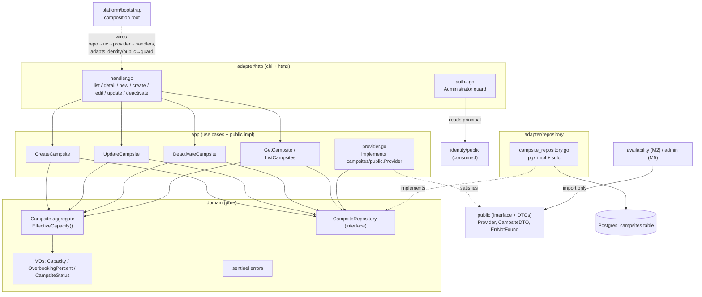

# Campsite Management Design

**Spec**: `.specs/features/M1-identity-setup/campsite-management/spec.md`
**Status**: Draft

---

## Architecture Overview

The `campsites` module is a full bounded context implemented across all four Clean Architecture layers. A rich `Campsite` aggregate (Acampamento) owns its invariants and the `EffectiveCapacity()` calculation; single-purpose use cases orchestrate it; a pgx repository persists it; thin htmx handlers (guarded by an Administrator check) drive the admin CRUD; and a small `public` port exposes flat DTOs to downstream modules. Dependencies point inward; the only importable surface for other modules is `campsites/public`.



---

## Modules & Clean Architecture Layers Touched

| Layer | This feature adds | Path root |
| ----- | ----------------- | --------- |
| `domain` | `Campsite` aggregate + factory, VOs (`Capacity`, `OverbookingPercent`, `CampsiteStatus`), `CampsiteRepository` interface, sentinel errors | `internal/modules/campsites/domain/` |
| `app` | Use cases (`CreateCampsite`, `UpdateCampsite`, `DeactivateCampsite`, `GetCampsite`, `ListCampsites`), command/result/view DTOs, `Provider` impl of the public port | `internal/modules/campsites/app/` |
| `adapter/repository` | pgx/sqlc `CampsiteRepository` implementation | `internal/modules/campsites/adapter/repository/` |
| `adapter/http` | Admin htmx CRUD handlers + Administrator guard | `internal/modules/campsites/adapter/http/` |
| `public` | `Provider` interface, `CampsiteDTO`, `ErrNotFound` | `internal/modules/campsites/public/` |
| `db` | `campsites` table migration + sqlc queries | `db/migrations/`, `db/queries/campsites.sql` |
| templates | admin htmx partials | `web/templates/campsites/` |
| composition root | construct + wire (repo → use cases → provider → handlers), mount routes, adapt `identity/public` guard | `internal/platform/bootstrap/` |

### Module Boundary Rule (design-level statement)

Per ARCHITECTURE §2 (**non-negotiable**):

- **Exposes** `campsites/public.Provider` + `CampsiteDTO` (flat primitives) — the *only* surface `availability` (M2) and `admin` (M5) may import. The domain `Campsite` and its VOs **never** cross the boundary; `app/provider.go` maps domain → DTO inside the module.
- **Consumes** `identity/public` for the Administrator role check (provider-owned port; role semantics belong to identity). `adapter/http/authz.go` imports `identity/public` only — never `identity/domain` or `identity/app`. If identity's admin accessor is not final, campsites declares a minimal consumer-owned `AdminGuard` and the composition root adapts `identity/public` to it.
- Consumes `internal/shared/id` (UUID generation) and `internal/platform/postgres` (pool + `WithTx`) — allowed cross-cutting infra.

---

## DDD Building Blocks

- **Aggregate root — `Campsite` (Acampamento).** Identity (`CampsiteID`, a UUID string) + lifecycle. All mutation goes through methods that re-enforce invariants; fields are unexported (no external field-setting). Holds `EffectiveCapacity()` behavior — the model is **not** anemic.
- **Value Objects** (immutable, self-validating in constructor):
  - `Capacity` — wraps `int`, invariant `>= 0` (per brief); `NewCapacity(int) (Capacity, error)`.
  - `OverbookingPercent` — wraps `int` (whole percent), invariant `>= 0`; `NewOverbookingPercent(int) (OverbookingPercent, error)`.
  - `CampsiteStatus` — enum `Ativo` / `Inativo`; `ParseCampsiteStatus(string) (CampsiteStatus, error)`; helpers `IsActive()`.
- **Factory** — `NewCampsite(id, name, location, description string, cap Capacity, ob OverbookingPercent, notes string) (*Campsite, error)` centralizes invariant checks (non-empty name), status defaults to `Ativo`. A separate reconstruction constructor `Reconstitute(...)` rebuilds an aggregate from persisted state (used by the repository) without re-running create-only defaults.
- **Domain behavior on the aggregate**: `EffectiveCapacity() int` (= `cap + floor(cap × pct / 100)`), `UpdateDetails(...)`, `ChangeCapacity(Capacity)`, `ChangeOverbooking(OverbookingPercent)`, `Deactivate()`, `Activate()` (available even if not surfaced in MVP UI).
- **Repository** — `CampsiteRepository` interface in `domain` (one per aggregate root). pgx impl in `adapter/repository`.
- **No domain service** — effective capacity belongs to the single aggregate, so a service would be anemic-inducing; deliberately avoided (KISS/DDD).
- **No domain events** — no cross-module reaction is needed at create/update/deactivate time (availability reads live via the public port). YAGNI; add later if M2 wants push invalidation.

**Ubiquitous language:** type `Campsite` = Acampamento; status literals kept PT-BR (`Ativo`, `Inativo`); "effective capacity" = capacidade efetiva.

---

## Public Interfaces (exposed / consumed)

### Exposed — `internal/modules/campsites/public/provider.go`

```go
package public

import (
    "context"
    "errors"
)

// ErrNotFound is returned when a campsiteID has no matching Acampamento.
// Public sentinel — consumers compare with errors.Is; domain errors never leak.
var ErrNotFound = errors.New("campsites: campsite not found")

// CampsiteDTO is a flat, primitives-only snapshot for other modules.
// No domain entity or value object crosses this boundary.
type CampsiteDTO struct {
    ID                 string
    Name               string
    Location           string
    Capacity           int
    OverbookingPercent int
    EffectiveCapacity  int
    Status             string // "Ativo" | "Inativo"
}

// Provider is the read port consumed by availability (M2) and admin (M5).
// Small, consumer-shaped (ISP): only what downstream needs.
type Provider interface {
    // EffectiveCapacity returns capacity + floor(capacity*overbooking%/100).
    // Returns ErrNotFound if the campsite does not exist.
    EffectiveCapacity(ctx context.Context, campsiteID string) (int, error)
    // ActiveCampsites returns only Ativo campsites as flat DTOs.
    ActiveCampsites(ctx context.Context) ([]CampsiteDTO, error)
    // GetCampsite returns one campsite (any status) or ErrNotFound.
    GetCampsite(ctx context.Context, campsiteID string) (CampsiteDTO, error)
}
```

Implemented by `app/provider.go` (`type providerService struct { repo domain.CampsiteRepository }`), which loads aggregates and maps them to DTOs (`toDTO(*domain.Campsite) public.CampsiteDTO`, calling `EffectiveCapacity()`). Wired at the composition root; concrete type stays private to the module.

### Consumed — `identity/public` (Administrator authorization)

`adapter/http/authz.go` depends on the identity principal accessor to gate management routes. Expected minimal shape (owned by the `authentication` feature):

```go
// identity/public (illustrative — authored by the authentication feature)
// PrincipalFromContext returns the authenticated principal populated by
// identity's session middleware, and whether one is present.
//   type Principal struct { UserID string; Role string } // Role includes "Administrator"
//   func PrincipalFromContext(ctx context.Context) (Principal, bool)

// campsites consumer-owned fallback port (used only if identity/public's admin
// helper is not final at implementation time; adapted at the composition root):
type AdminGuard interface {
    IsAdministrator(ctx context.Context) bool
}
```

The guard is applied as chi middleware on the campsites route group; on failure it renders 403 / redirects to login and the use case is never reached.

---

## Data Models

### Table `campsites`

Migration `db/migrations/0000NN_create_campsites.up.sql` (sequence assigned at implementation time within the single gap-free stream — after `000001_baseline`; coordinate with sibling M1 migrations `identity`, `config`). `.down.sql` drops the table.

```sql
-- up
CREATE TABLE campsites (
    id                  UUID        PRIMARY KEY,           -- generated in Go (internal/shared/id)
    name                TEXT        NOT NULL,
    location            TEXT        NOT NULL DEFAULT '',
    description         TEXT        NOT NULL DEFAULT '',
    capacity            INTEGER     NOT NULL,
    overbooking_percent INTEGER     NOT NULL DEFAULT 0,
    status              TEXT        NOT NULL DEFAULT 'Ativo',
    notes               TEXT        NOT NULL DEFAULT '',
    created_at          TIMESTAMPTZ NOT NULL DEFAULT now(),
    updated_at          TIMESTAMPTZ NOT NULL DEFAULT now(),
    CONSTRAINT campsites_name_not_blank    CHECK (length(btrim(name)) > 0),
    CONSTRAINT campsites_capacity_nonneg   CHECK (capacity >= 0),
    CONSTRAINT campsites_overbooking_nonneg CHECK (overbooking_percent >= 0),
    CONSTRAINT campsites_status_valid      CHECK (status IN ('Ativo', 'Inativo'))
);

-- Supports Provider.ActiveCampsites (status filter).
CREATE INDEX campsites_status_idx ON campsites (status);
```

```sql
-- down
DROP TABLE IF EXISTS campsites;
```

**DB constraints mirror domain invariants** (defense in depth) but are not the primary guard — the aggregate is. `updated_at` is set by the repository on each `Save` (or a trigger; repository-set for KISS). No range types / exclusion constraints (those belong to reservations/availability).

### sqlc queries — `db/queries/campsites.sql`

`InsertCampsite`, `UpdateCampsite`, `GetCampsiteByID`, `ListCampsites` (all), `ListCampsitesByStatus` (Ativo). sqlc generates typed code into `internal/modules/campsites/adapter/repository` per `sqlc.yaml`'s per-module output convention (established by data-migration DATA-12). Effective capacity is **not** a DB column — it is computed by the domain, never persisted (PRD §6: derived, not stored).

### App-layer DTOs (not crossing modules)

- `CreateCampsiteCommand{ Name, Location, Description string; Capacity, OverbookingPercent int; Notes string }` → `CreateCampsiteResult{ ID string }`.
- `UpdateCampsiteCommand{ ID, Name, Location, Description string; Capacity, OverbookingPercent int; Notes string }`.
- `DeactivateCampsiteCommand{ ID string }`.
- `CampsiteView{ ID, Name, Location, Description string; Capacity, OverbookingPercent, EffectiveCapacity int; Status, Notes string }` — returned by `GetCampsite` / `ListCampsites` for the admin handlers.

---

## Components

### domain.Campsite + VOs

- **Purpose**: Rich aggregate enforcing invariants and computing effective capacity.
- **Location**: `internal/modules/campsites/domain/{campsite.go,capacity.go,overbooking.go,status.go,errors.go}`
- **Interfaces**: `NewCampsite(...) (*Campsite, error)`, `Reconstitute(...) *Campsite`, `EffectiveCapacity() int`, `UpdateDetails(name,loc,desc,notes string) error`, `ChangeCapacity(Capacity)`, `ChangeOverbooking(OverbookingPercent)`, `Activate()`, `Deactivate()`, plus getters for mapping. VO constructors `NewCapacity`, `NewOverbookingPercent`, `ParseCampsiteStatus`.
- **Dependencies**: stdlib only.
- **Reuses**: `internal/shared/id` for UUID (ID generated in the create use case or factory).

### domain.CampsiteRepository

- **Purpose**: Persistence port for the aggregate (one repo per root).
- **Location**: `internal/modules/campsites/domain/repository.go`
- **Interfaces**: `Save(ctx, *Campsite) error` (insert-or-update), `FindByID(ctx, id string) (*Campsite, error)` (`ErrCampsiteNotFound` if absent), `List(ctx, onlyActive bool) ([]*Campsite, error)`.
- **Dependencies**: own domain only.

### app use cases

- **Purpose**: Single-purpose orchestration (SRP).
- **Location**: `internal/modules/campsites/app/{create_campsite.go,update_campsite.go,deactivate_campsite.go,queries.go,dto.go}`
- **Interfaces**:
  - `CreateCampsite.Handle(ctx, CreateCampsiteCommand) (CreateCampsiteResult, error)` — build VOs + aggregate (generate ID), `repo.Save`.
  - `UpdateCampsite.Handle(ctx, UpdateCampsiteCommand) error` — `FindByID`, mutate via aggregate methods, `Save`.
  - `DeactivateCampsite.Handle(ctx, DeactivateCampsiteCommand) error` — `FindByID`, `Deactivate()`, `Save` (idempotent).
  - `GetCampsite.Handle(ctx, id) (CampsiteView, error)`; `ListCampsites.Handle(ctx, onlyActive bool) ([]CampsiteView, error)`.
- **Dependencies**: `domain` (aggregate + repo interface). No adapter, no other module.
- **Reuses**: `internal/shared/id`.

### app.Provider (public impl)

- **Purpose**: Map domain → `public.CampsiteDTO`; satisfy `campsites/public.Provider`.
- **Location**: `internal/modules/campsites/app/provider.go`
- **Interfaces**: implements `public.Provider`; translates `domain.ErrCampsiteNotFound` → `public.ErrNotFound`.
- **Dependencies**: `domain`, `campsites/public` (own public — DTOs only, no cycle).

### adapter/repository.CampsiteRepository (pgx)

- **Purpose**: Implement the domain port over Postgres via sqlc + `WithTx`.
- **Location**: `internal/modules/campsites/adapter/repository/campsite_repository.go`
- **Interfaces**: implements `domain.CampsiteRepository`; `Save` upserts (INSERT on new, UPDATE on existing — repository tracks by ID existence or uses `INSERT ... ON CONFLICT (id) DO UPDATE`), sets `updated_at`; maps rows → `domain.Reconstitute`.
- **Dependencies**: `internal/platform/postgres` (pool/tx), generated sqlc, `domain`.
- **Reuses**: `postgres.WithTx`, `pgtest` harness in tests.

### adapter/http (handlers + authz)

- **Purpose**: Thin htmx admin CRUD; Administrator gate.
- **Location**: `internal/modules/campsites/adapter/http/{handler.go,authz.go}` + `web/templates/campsites/{list.html,detail.html,form.html,row.html}`
- **Interfaces**: `Routes(r chi.Router)` mounting `GET /admin/campsites` (list), `GET /admin/campsites/{id}` (detail), `GET /admin/campsites/new` (form), `POST /admin/campsites` (create), `GET /admin/campsites/{id}/edit` (form), `PUT /admin/campsites/{id}` (update), `POST /admin/campsites/{id}/deactivate`. Handlers decode → validate → call use case → render fragment/redirect. `authz.go` wraps the group with the Administrator guard.
- **Dependencies**: `app` use cases, `identity/public` (via guard), `internal/platform/web` renderer.
- **Reuses**: `web.Renderer.Page` (full vs fragment by `HX-Request`), htmx swap patterns.

### composition-root wiring

- **Purpose**: Construct repo → use cases → provider → handlers, mount routes, inject the identity admin guard; expose the module's `public.Provider` for M2/M5 wiring.
- **Location**: `internal/platform/bootstrap/` (extends existing composition root; campsites implements the `bootstrap.Module` seam).
- **Reuses**: `bootstrap.Module.Mount(chi.Router)` seam (SKEL).

---

## Code Reuse Analysis

### Existing Components to Leverage

| Component | Location | How to Use |
| --------- | -------- | ---------- |
| `postgres.WithTx` / pool | `internal/platform/postgres` | Transaction boundary + pool in the repository |
| `pgtest.Setup` | `internal/platform/postgres/pgtest` | Migrated Postgres 16 + isolation in integration tests |
| `id` (UUID) | `internal/shared/id` | Generate `CampsiteID` in the create use case/factory |
| `web.Renderer` | `internal/platform/web` | Render htmx full pages / fragments |
| `bootstrap.Module` seam | `internal/platform/bootstrap` | Mount campsite routes without leaking internals |
| `sqlc.yaml` per-module convention | repo root (DATA-12) | Generate typed queries into `adapter/repository` |
| golang-migrate stream | `db/migrations` (DATA-04) | Add `0000NN_create_campsites` following the naming/reversible contract |

### Integration Points

| System | Integration Method |
| ------ | ------------------ |
| `identity/public` (M1 authentication) | Consumed for the Administrator principal/role in `authz.go`; adapted at composition root if the accessor shape is not final. |
| `availability` (M2, AVL) | Imports `campsites/public.Provider` for `EffectiveCapacity` + `ActiveCampsites`; recomputes availability forward when capacity/overbooking changes (PRD §13 seam). |
| `admin` (M5, DSH/MGT) | Imports `campsites/public` for the campsites overview + park-total aggregation (sum of effective capacities). |
| `config` (M1, CFG) | Independent: system-wide overbooking default lives in CFG; here overbooking % is a per-campsite override/field only. |

---

## Error Handling Strategy

| Error Scenario | Handling | User Impact |
| -------------- | -------- | ----------- |
| Invalid VO on create/update (capacity < 0, overbooking < 0, blank name) | Constructor/factory returns wrapped domain error; use case returns it; handler maps → 422 with an htmx error fragment | Inline validation message; nothing persisted |
| `FindByID` on unknown ID | Repository returns `domain.ErrCampsiteNotFound`; handler maps → 404; provider maps → `public.ErrNotFound` | 404 page / `ErrNotFound` to consumer |
| Deactivate already-Inativo | Aggregate `Deactivate()` is idempotent (no-op if already Inativo); `Save` succeeds | 200, status unchanged |
| Non-admin hits a management route | `authz` guard denies before the handler body | 403 / redirect to login |
| DB failure in `Save`/`List` | Wrapped with `fmt.Errorf("...: %w", err)`; handler → 500; tx rolled back via `WithTx` | Generic 500; no partial write |
| Malformed form input (non-integer capacity) | Handler decode returns validation error → 422 fragment | Inline message |
| Concurrent edits to same campsite | Last-write-wins; each `Save` is a single-aggregate tx (atomic) | No corruption; later write persists |

Convention (CONVENTIONS.md): return `error`, wrap with `%w`; sentinel domain errors in `domain/errors.go` (`ErrCampsiteNotFound`, `ErrEmptyName`, `ErrInvalidCapacity`, `ErrInvalidOverbooking`, `ErrInvalidStatus`); handlers map domain errors → HTTP status; no panics for control flow; `errors.Is` for comparisons.

---

## Tech Decisions (only non-obvious ones)

| Decision | Choice | Rationale |
| -------- | ------ | --------- |
| Effective capacity | `capacity + floor(capacity × overbooking% / 100)`, computed on the aggregate; never persisted | PRD §6 says it is *derived*; flooring never oversells a fractional vacancy; on the aggregate keeps the model rich (no anemic service). |
| Overbooking % type | Whole integer percent VO (`>= 0`) | PRD "percentual"; integer keeps arithmetic exact and UI simple (YAGNI on fractional %). |
| Capacity invariant | `>= 0` (per brief) | Matches dispatch; a 0-capacity site yields effective 0 (bookable by nobody) rather than an error, keeping the VO total. |
| ID generation | Go-side UUID via `internal/shared/id` in the create use case | Aggregate has identity at construction (DDD); keeps repository dumb and domain testable without a DB. |
| `Save` upsert | `INSERT ... ON CONFLICT (id) DO UPDATE` | One repository method for create + update; single-aggregate transaction. |
| Provider impl in `app` (not adapter) | `app/provider.go` maps domain → DTO | Mapping is application logic over the domain; `public` holds only the interface + DTOs (import-cycle-free). |
| Authorization port ownership | Consume `identity/public` (provider-owned); consumer-owned `AdminGuard` fallback | Role semantics belong to identity (ARCHITECTURE §2 "provider-defined contract"); fallback keeps campsites unblocked if identity's accessor is still in flight. |
| No domain events on change | Omitted for MVP | Availability reads effective capacity live via the public port on each query; push invalidation is YAGNI until M2 needs it (PRD §13 handled by forward recompute). |
| DB CHECK constraints mirror invariants | Added in the migration | Defense in depth; the aggregate remains the primary guard, the DB is the backstop. |
| Status literals PT-BR in DB | `'Ativo'`/`'Inativo'` | Preserve ubiquitous language end-to-end (CONVENTIONS.md language rule). |
| Migration sequence number | `0000NN` placeholder, fixed at implementation | Single gap-free stream shared with sibling M1 features (identity, config); exact number assigned during Execute to avoid collisions. |
