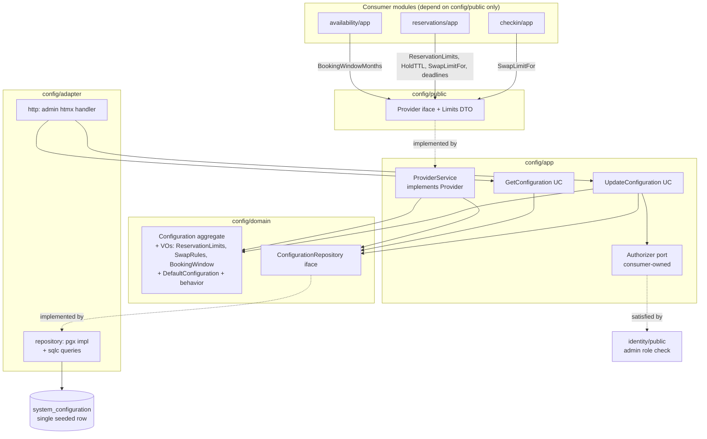

# System Configuration Design

**Spec**: `.specs/features/M1-identity-setup/system-configuration/spec.md`
**Status**: Draft

---

## Architecture Overview

A full bounded-context module in `internal/modules/config/{domain,app,adapter,public}` following
Clean Architecture (dependencies point inward) and a rich DDD domain. The module owns one
aggregate — `Configuration` — persisted as a **single seeded row** in `system_configuration`.

Two surfaces:

1. **Downstream (read):** `config/public.Provider` — a minimal typed provider (flat DTOs) that
   availability, reservations, and checkin consume. Implemented by `app.ProviderService`, which
   loads the aggregate through the repository and delegates to domain behavior. This is the **only**
   cross-module surface (module-boundary rule).
2. **Admin (write):** `GetConfiguration` / `UpdateConfiguration` use cases behind a thin htmx
   `adapter/http` handler, guarded by `identity/public` (Administrator only).

Config-owned derived-rule logic (`SwapLimitFor`, deadline computation) lives in the domain (DRY
single source of truth); consumers pass `now`/`groupSize` in and read a value out. **The
booking-window horizon is stored here (raw months) but its sliding-end computation is owned by
`availability`** (its `BookingWindow` VO enforces `ErrOutsideBookingWindow` on every `Reserve`) — a
single owner for that math; config merely exposes `BookingWindowMonths()`.



**Composition root** (`internal/platform/bootstrap`) constructs the pgx repository → use cases +
`ProviderService`, wires `identity/public`'s admin check into the `Authorizer` port, injects the
`ProviderService` into the availability/reservations/checkin use cases, and mounts the admin route
under the identity admin group.

---

## Module(s), Clean Architecture Layers & DDD

- **Module:** `config` (bounded context). Touches all four layers: `domain`, `app`, `adapter`
  (`repository` + `http`), `public`.
- **Layers:**
  - `domain` — pure: aggregate, VOs, domain behavior, repository interface, sentinel errors. No SQL/HTTP.
  - `app` — `ProviderService` (implements `public.Provider`), `GetConfiguration`/`UpdateConfiguration`
    use cases, consumer-owned `Authorizer` port, command/result DTOs.
  - `adapter/repository` — pgx/sqlc implementation of `ConfigurationRepository`.
  - `adapter/http` — thin htmx admin handler.
  - `public` — `Provider` interface + flat DTOs only (no domain types cross the boundary).
- **DDD building blocks:**
  - **Aggregate root:** `Configuration` — the consistency boundary for all settings; mutated only
    through methods that re-validate invariants. Single logical instance (one row).
  - **Value Objects:** `ReservationLimits{PF,PJ}`, `SwapRules` (ordered `[]SwapBracket`),
    `BookingWindow{MonthsAhead}` — each self-validating in its constructor. Durations
    (hold TTL, cancellation/change deadlines) and `overbookingPercent` are validated fields on the
    aggregate (a bare positive-duration wrapper per field would be VO-noise — YAGNI).
  - **Domain behavior (rich, not anemic):** `SwapRules.LimitFor(groupSize) int`,
    `BookingWindow.Months() int` (raw horizon only — no date math), aggregate
    `CancellationDeadlineAt(entry)` / `ChangeDeadlineAt(entry)`. The window's `EndFrom(now)` /
    within-window check is **not** here — `availability` owns that computation.
  - **Factory:** `DefaultConfiguration()` (PRD defaults) and
    `ReconstituteConfiguration(...) (*Configuration, error)` (rehydrate from a persisted row).
  - **Repository:** `ConfigurationRepository` (interface in `domain`, pgx impl in `adapter`).
  - **Domain Service:** none — a single aggregate holds all behavior (no cross-aggregate logic).
  - **Domain Events:** none — configuration changes drive no cross-module reaction in MVP (YAGNI;
    consumers read current config at operation time).

### Module boundary statement

`config` exposes **only** `config/public` (Provider interface + flat DTOs). Consumers
(availability, reservations, checkin) import that package and nothing else — never `config/domain`
or `config/app`. Domain VOs are mapped to flat DTOs (`Limits{PF,PJ}`, `time.Duration`, `int`,
`time.Time`) inside `ProviderService`; no aggregate or VO crosses the boundary. Following ISP,
each consumer declares its own **narrow** interface (subset of `Provider`) that `ProviderService`
satisfies — e.g. reservations declares `HoldPolicy`/`LimitPolicy`, checkin declares
`SwapPolicy` — so no consumer depends on methods it does not use.

For authorization, `config/app` declares a **consumer-owned `Authorizer` port**
(`EnsureAdministrator(ctx) error`); the concrete implementation is provided by `identity/public`
and injected at the composition root. `config` never imports `identity/domain` or `identity/app`.

---

## Code Reuse Analysis

### Existing Components to Leverage

| Component | Location | How to Use |
| --------- | -------- | ---------- |
| pgx pool (`*pgxpool.Pool`) | `internal/platform/postgres` (DATA) | Repository executes sqlc queries against it |
| `WithTx` transaction boundary | `internal/platform/postgres` (DATA) | `UpdateConfiguration` persists inside one transaction |
| `pgtest.Setup` testcontainer harness | `internal/platform/postgres/pgtest` (DATA) | Repository/provider/http integration tests get a migrated, seeded, isolated DB |
| Migration stream + conventions | `db/migrations` + DATA design | Add `NNNNNN_system_configuration` up/down; `btree_gist` already enabled by baseline (unused here) |
| sqlc codegen convention | `sqlc.yaml` (DATA) | Add a `config` block generating typed queries into the repository package |
| chi router + identity admin group | `internal/platform/httpx` (SKEL) + `identity/public` (AUTH) | Mount the admin edit route under the authenticated-Administrator group |
| base html/template layout + htmx | `internal/platform/web` (SKEL) | Render the config edit fragment |

### Integration Points

| System | Integration Method |
| ------ | ------------------ |
| DATA `postgres` | Repository uses the injected pool + `WithTx`; no env reads here |
| `identity/public` (AUTH) | Provides the admin-role check wired into `config/app.Authorizer`; middleware guards the route |
| availability (AVL) | Consumes `Provider.BookingWindowMonths` **only** — availability owns the sliding-window computation (its `BookingWindow` VO computes the horizon from months + the injected clock). It does **not** consume overbooking: the per-Diária effective capacity (overbooking already baked in) comes from `campsites/public.EffectiveCapacity`; consuming `DefaultOverbookingPercent` here would double-count it. |
| reservations (RSV) | Consumes `Provider.ReservationLimits`, `HoldTTL`, `SwapLimitFor`, `CancellationDeadline`, `ChangeDeadline` |
| checkin (CHK) | Consumes `Provider.SwapLimitFor` (participant-divergence limit) |
| campsites (CAMP) | Owns authoritative per-campsite overbooking %; config's `DefaultOverbookingPercent` is a **seed default** for the new-campsite form only — never a runtime input to availability |

---

## Components

### domain: ReservationLimits (VO)

- **Purpose**: Immutable PF/PJ per-reservation limits with the PF ≤ PJ invariant.
- **Location**: `internal/modules/config/domain/reservation_limits.go`
- **Interfaces**:
  - `NewReservationLimits(pf, pj int) (ReservationLimits, error)` — `pf>0`, `pj>=pf`, else `ErrInvalidReservationLimits`.
  - `(ReservationLimits) PF() int` / `PJ() int`
- **Dependencies**: stdlib only.
- **Reuses**: —

### domain: SwapRules + SwapBracket (VO)

- **Purpose**: Ordered swap brackets with the group-size→swap-limit step function.
- **Location**: `internal/modules/config/domain/swap_rules.go`
- **Interfaces**:
  - `type SwapBracket struct { UpTo, Swaps int }` (value type, exported flat fields for mapping)
  - `NewSwapRules(brackets []SwapBracket, coverUpTo int) (SwapRules, error)` — validates brackets
    strictly ascending by `UpTo`, `Swaps>=0` non-decreasing, first bracket starts at group size 1,
    last `UpTo >= coverUpTo` (the PJ limit); else `ErrInvalidSwapRules`.
  - `(SwapRules) LimitFor(groupSize int) int` — `groupSize<=0`→0; first bracket whose `UpTo >=
    groupSize`; above the largest bracket→largest bracket's `Swaps` (clamp).
  - `(SwapRules) Brackets() []SwapBracket` — defensive copy for mapping.
- **Dependencies**: stdlib only.
- **Reuses**: —

### domain: BookingWindow (VO)

- **Purpose**: How many months ahead of the current month reservations open; window-end derivation.
- **Location**: `internal/modules/config/domain/booking_window.go`
- **Interfaces**:
  - `NewBookingWindow(monthsAhead int) (BookingWindow, error)` — `monthsAhead>=0`, else `ErrInvalidBookingWindow`.
  - `(BookingWindow) EndFrom(now time.Time) time.Time` — last date of month(`now`)+`MonthsAhead`
    (e.g. now=July, months=2 → Sep 30). Computed as first-of-month(now)+(months+1)−1 day; time-of-day
    normalized to the day boundary; caller's location preserved.
  - `(BookingWindow) MonthsAhead() int`
- **Dependencies**: stdlib `time`.
- **Reuses**: —

### domain: Configuration (aggregate) + DefaultConfiguration + errors + repository interface

- **Purpose**: Aggregate root composing all settings, enforcing cross-field invariants and owning
  derived-rule behavior; the defaults factory; sentinel errors; the repository port.
- **Location**: `internal/modules/config/domain/configuration.go`,
  `internal/modules/config/domain/defaults.go`, `internal/modules/config/domain/errors.go`,
  `internal/modules/config/domain/repository.go`
- **Interfaces**:
  - `NewConfiguration(limits ReservationLimits, window BookingWindow, holdTTL, cancelDeadline,
    changeDeadline time.Duration, swap SwapRules, overbookingPercent int) (*Configuration, error)` —
    validates `holdTTL>0`, deadlines `>=0`, `overbookingPercent` in 0..100; `swap` must cover
    `limits.PJ()`; else the matching sentinel error.
  - `DefaultConfiguration() *Configuration` — PRD defaults (PF 5, PJ 15, window 2, cancel 24h,
    change 24h, hold 10m, swap {UpTo5→1, UpTo10→2, UpTo15→3}, overbooking default). Cannot fail.
  - `ReconstituteConfiguration(...) (*Configuration, error)` — rebuild from persisted primitives
    (used by the repository) with the same validation.
  - Accessors: `Limits() ReservationLimits`, `Window() BookingWindow`, `HoldTTL() time.Duration`,
    `CancellationDeadline() time.Duration`, `ChangeDeadline() time.Duration`, `Swap() SwapRules`,
    `OverbookingPercent() int`, `UpdatedAt() time.Time`.
  - Behavior: `SwapLimitFor(groupSize int) int` (delegates to `Swap()`),
    `CancellationDeadlineAt(entry time.Time) time.Time` (`entry - CancellationDeadline`),
    `ChangeDeadlineAt(entry time.Time) time.Time`. `Window() BookingWindow` exposes the raw months
    (`BookingWindow.Months() int`); the sliding-end / within-window computation is **not** here — it
    is owned by `availability` (avoids two owners of the same month-arithmetic).
  - Mutation: `Apply(change ConfigurationChange) error` — validates + replaces settings atomically
    (used by `UpdateConfiguration`); on error the aggregate is unchanged.
  - `ConfigurationRepository interface { Load(ctx) (*Configuration, error); Save(ctx, *Configuration) error }`
  - Sentinels: `ErrInvalidReservationLimits`, `ErrInvalidBookingWindow`, `ErrInvalidHoldTTL`,
    `ErrInvalidDeadline`, `ErrInvalidOverbooking`, `ErrInvalidSwapRules`, `ErrConfigurationNotFound`.
- **Dependencies**: stdlib (`time`, `errors`), own VOs.
- **Reuses**: the VOs above.

### app: ProviderService (implements public.Provider)

- **Purpose**: Cross-module read surface — load the aggregate, delegate behavior, map to flat DTOs.
- **Location**: `internal/modules/config/app/provider_service.go`
- **Interfaces** (implements `public.Provider`):
  - `NewProviderService(repo domain.ConfigurationRepository) *ProviderService`
  - `ReservationLimits(ctx) (public.Limits, error)`, `HoldTTL(ctx) (time.Duration, error)`,
    `CancellationDeadline(ctx) (time.Duration, error)`, `ChangeDeadline(ctx) (time.Duration, error)`,
    `SwapLimitFor(ctx, groupSize int) (int, error)`, `BookingWindowMonths(ctx) (int, error)`,
    `DefaultOverbookingPercent(ctx) (int, error)` — each loads via `repo.Load`; on load error returns
    the error (fail closed). `BookingWindowMonths` returns the raw configured horizon in months;
    availability (not config) computes the sliding end date from it — a single owner for that math.
- **Dependencies**: `domain`, `public`.
- **Reuses**: `ConfigurationRepository`.

### app: GetConfiguration + UpdateConfiguration + Authorizer port + DTOs

- **Purpose**: Administrator read/write use cases (SRP: one purpose each).
- **Location**: `internal/modules/config/app/get_configuration.go`,
  `internal/modules/config/app/update_configuration.go`, `internal/modules/config/app/ports.go`,
  `internal/modules/config/app/dto.go`
- **Interfaces**:
  - `type Authorizer interface { EnsureAdministrator(ctx context.Context) error }` — consumer-owned,
    satisfied by `identity/public`.
  - `type ConfigurationView struct { LimitPF, LimitPJ, BookingWindowMonths, OverbookingPercent int;
    HoldTTL, CancellationDeadline, ChangeDeadline time.Duration; SwapBrackets []SwapBracketDTO }`
    (flat result DTO); `type SwapBracketDTO struct { UpTo, Swaps int }`.
  - `type UpdateConfigurationCommand struct { /* same flat fields as ConfigurationView */ }`.
  - `NewGetConfiguration(repo) *GetConfiguration`; `(*GetConfiguration) Execute(ctx) (ConfigurationView, error)`.
  - `NewUpdateConfiguration(repo, authz Authorizer, db TxRunner) *UpdateConfiguration`;
    `(*UpdateConfiguration) Execute(ctx, cmd UpdateConfigurationCommand) (ConfigurationView, error)` —
    `authz.EnsureAdministrator` → build/validate settings (domain) → `Apply` → `repo.Save` in a tx.
- **Dependencies**: `domain`, `context`, DATA `WithTx` (via a small `TxRunner` port or the repo owns
  its own transaction — see Tech Decisions).
- **Reuses**: `ConfigurationRepository`, domain validation.

### adapter/repository: ConfigurationRepository (pgx)

- **Purpose**: Persist/rehydrate the singleton aggregate.
- **Location**: `internal/modules/config/adapter/repository/configuration_repository.go`
  (+ sqlc-generated `.../repository/sqlc/`)
- **Interfaces**:
  - `NewRepository(pool *pgxpool.Pool) *Repository`
  - `Load(ctx) (*domain.Configuration, error)` — `SELECT` the singleton; map `interval`→`time.Duration`,
    `jsonb`→`[]SwapBracket`; `ReconstituteConfiguration(...)`; no row → `ErrConfigurationNotFound`.
  - `Save(ctx, *domain.Configuration) error` — `UPDATE` the singleton row from aggregate accessors.
- **Dependencies**: `pgx/v5/pgxpool`, DATA `postgres`, sqlc-generated queries, `domain`.
- **Reuses**: DATA pool + `WithTx`; sqlc typed queries.

### adapter/http: admin edit handler

- **Purpose**: Minimal htmx surface to view + update configuration (thin: decode→use case→render).
- **Location**: `internal/modules/config/adapter/http/configuration_handler.go`,
  templates `web/templates/config/edit.html`, `web/templates/config/_form.html`
- **Interfaces**:
  - `NewHandler(get *app.GetConfiguration, upd *app.UpdateConfiguration) *Handler`
  - `(*Handler) Routes() chi.Router` — `GET /` (render current values), `POST /` (parse form →
    `UpdateConfigurationCommand` → `Execute`; on validation error render the form fragment with
    messages; on success render a success fragment).
- **Dependencies**: chi, `internal/platform/web`, `app`.
- **Reuses**: SKEL layout/htmx helpers; mounted behind identity admin middleware at the root.

### public: Provider interface + DTOs

- **Purpose**: The only importable cross-module surface.
- **Location**: `internal/modules/config/public/provider.go`
- **Interfaces**:
  - `type Limits struct { PF int; PJ int }`
  - `type Provider interface { ReservationLimits(ctx context.Context) (Limits, error);
    HoldTTL(ctx context.Context) (time.Duration, error);
    CancellationDeadline(ctx context.Context) (time.Duration, error);
    ChangeDeadline(ctx context.Context) (time.Duration, error);
    SwapLimitFor(ctx context.Context, groupSize int) (int, error);
    BookingWindowMonths(ctx context.Context) (int, error);
    DefaultOverbookingPercent(ctx context.Context) (int, error) }`
- **Dependencies**: stdlib (`context`, `time`) only — no domain import.
- **Reuses**: —

---

## Data Models

### Postgres: `system_configuration` (single seeded row)

```sql
CREATE TABLE system_configuration (
    id                       boolean     PRIMARY KEY DEFAULT true CHECK (id),      -- singleton guard: only one row (id = true)
    reservation_limit_pf     integer     NOT NULL CHECK (reservation_limit_pf > 0),
    reservation_limit_pj     integer     NOT NULL CHECK (reservation_limit_pj >= reservation_limit_pf),
    booking_window_months    integer     NOT NULL CHECK (booking_window_months >= 0),
    hold_ttl                 interval    NOT NULL CHECK (hold_ttl > interval '0'),
    cancellation_deadline    interval    NOT NULL CHECK (cancellation_deadline >= interval '0'),
    change_deadline          interval    NOT NULL CHECK (change_deadline >= interval '0'),
    swap_brackets            jsonb       NOT NULL CHECK (jsonb_typeof(swap_brackets) = 'array'),
    overbooking_percent      integer     NOT NULL CHECK (overbooking_percent BETWEEN 0 AND 100),
    updated_at               timestamptz NOT NULL DEFAULT now()
);

-- Seed the singleton with DefaultConfiguration() values (source of truth = domain defaults).
INSERT INTO system_configuration (
    id, reservation_limit_pf, reservation_limit_pj, booking_window_months,
    hold_ttl, cancellation_deadline, change_deadline, swap_brackets, overbooking_percent
) VALUES (
    true, 5, 15, 2,
    interval '10 minutes', interval '24 hours', interval '24 hours',
    '[{"up_to":5,"swaps":1},{"up_to":10,"swaps":2},{"up_to":15,"swaps":3}]'::jsonb, 0
);
```

- **`swap_brackets` shape**: JSON array of `{"up_to": int, "swaps": int}`, ascending by `up_to`.
  Structural consistency (covers 1..PJ, ascending) is validated in the **domain** on load/update;
  the DB CHECK only asserts it is an array (KISS — rich JSON constraints are domain-owned).
- **Singleton**: `id boolean PK DEFAULT true CHECK (id)` permits exactly one row (`true`); the app
  never inserts more. Migration seeds it; the repository only ever `UPDATE`s it.
- **Interval ↔ Duration**: pgx maps `interval` to `pgtype.Interval` (microseconds); the repository
  converts to/from `time.Duration`. Defaults use whole minutes/hours (no month/day components), so
  the conversion is exact.
- **`updated_at`**: set to `now()` on each `Save` (bookkeeping; no optimistic lock in MVP).

### Migration

- **Location**: `db/migrations/NNNNNN_system_configuration.up.sql` / `.down.sql` — `NNNNNN` assigned
  at implementation time (single stream, after M0 `000001_baseline`). Config has **no foreign keys**
  to identity/campsites, so its ordering among M1 features is independent.
- **`.down.sql`**: `DROP TABLE IF EXISTS system_configuration;` (real reversible down per DATA
  conventions).

### sqlc

- `db/queries/config.sql`: `GetConfiguration` (`SELECT ... WHERE id = true`) and
  `UpdateConfiguration` (`UPDATE ... SET ... , updated_at = now() WHERE id = true RETURNING *`).
- `sqlc.yaml`: add a `config` block → generate typed code into
  `internal/modules/config/adapter/repository/sqlc` (`pgx/v5`, `emit_interface: true`).

---

## Error Handling Strategy

| Error Scenario | Handling | User/Consumer Impact |
| -------------- | -------- | -------------------- |
| Invalid value in constructor/`Apply` (PF≤0, PJ<PF, TTL≤0, deadline<0, overbooking out of range, bad swap brackets) | Return the matching sentinel domain error; aggregate never enters an invalid state | `UpdateConfiguration` rejects the whole edit; store unchanged; handler renders field errors |
| Non-Administrator calls `UpdateConfiguration` | `Authorizer.EnsureAdministrator` returns an error before any load/mutation | 403 fragment; no DB write |
| Singleton row missing on `Load` | Repository returns `ErrConfigurationNotFound` | Provider methods return it (fail closed); admin GET surfaces a system error — not a normal path (seed guarantees the row) |
| Interval/jsonb decode failure on `Load` | Wrap with `fmt.Errorf("...: %w", err)`; return | Treated as a load error by callers |
| DB error during `Save` | `WithTx` rolls back; wrapped error returned | No partial persist; handler renders a generic error fragment |
| Concurrent admin `Save`s | Row UPDATE serializes; last committed wins | Both succeed; latest values persist (documented, MVP) |
| `SwapLimitFor(groupSize)` beyond largest bracket / ≤0 | Domain clamps to largest bracket / returns 0 | Deterministic, no error |

Conventions: sentinel errors in `domain`, compared via `errors.Is`; wrap with `%w`; `ctx` first
param on every use-case and repository method; no panics for control flow; DTOs crossing `public`
and `adapter/http` are flat primitives/std types.

---

## Tech Decisions (only non-obvious ones)

| Decision | Choice | Rationale |
| -------- | ------ | --------- |
| Store shape | **Single typed row** (not key/value) | Fixed, typed, cross-field-validated settings → typed columns + CHECK constraints + sqlc type safety; key/value loses types and PF≤PJ-style constraints. Enforced singleton. |
| Swap brackets storage | **JSONB** in the single row | Small ordered variable-length list read wholesale; a child table is overkill (YAGNI). Structural validation lives in the domain. |
| Duration storage | Postgres `interval` ↔ `time.Duration` | Semantically correct; pgx handles it; defaults are whole minutes/hours → exact conversion |
| Defaults source of truth | `DefaultConfiguration()` in domain; migration seed mirrors it | One place defines defaults; a `Load()==DefaultConfiguration()` integration test guards seed/domain drift |
| Provider fail-closed | Provider methods return the load error, never a fabricated default | A stale/absent config must not silently permit wrong rules downstream |
| Behavior placement | `SwapLimitFor` / deadline math in the **domain**, exposed via provider; booking-window **months** exposed raw (end computed by availability) | DRY single source of truth; consumers pass `now`/`groupSize`, read a value — no rule duplication. The window horizon has exactly one computation owner (availability), not two |
| Time handling | `now` passed **into** deadline methods (not an injected clock) | Provider stays stateless/pure; the consumer already holds the request clock (CONVENTIONS "inject the clock" is satisfied consumer-side) |
| Authorization | Consumer-owned `Authorizer` port in `config/app`, satisfied by `identity/public` | Enforces admin-only in the use case (testable with a fake) regardless of transport; keeps config free of identity internals; route also mounted behind the identity admin group |
| Transaction boundary | `UpdateConfiguration` wraps `repo.Save` in DATA `WithTx` (via a small `TxRunner` port) | One aggregate = one transaction; keeps the use case testable with a fake runner |
| Consumer interfaces | Consumers declare narrow subsets of `Provider` (ISP) | Each consumer depends only on the getters it uses; `ProviderService` satisfies all |
| No domain events | Omit for MVP | Config changes need no cross-module reaction; consumers read current values at operation time (YAGNI) |
