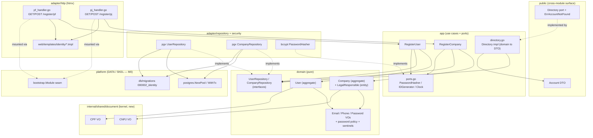

# User & Company Registration Design

**Spec**: `.specs/features/M1-identity-setup/user-company-registration/spec.md`
**Status**: Draft

---

## Architecture Overview

First behavior-bearing module of the system. It fills all four Clean Architecture layers of the
`identity` module and introduces the `internal/shared/document` kernel VOs (CPF, CNPJ). Dependencies
point inward only (ARCHITECTURE §3): `domain` is pure (stdlib + shared kernel VOs), `app` orchestrates
domain + ports, `adapter` wires pgx/chi/bcrypt, `public` exposes flat DTOs to other modules.

Two single-purpose use cases (`RegisterUser`, `RegisterCompany`) each: validate input into value
objects → check uniqueness → hash the password (via a port) → build the aggregate through its
factory → persist inside one `postgres.WithTx` transaction, translating a DB unique-violation into a
domain sentinel. Handlers are thin htmx endpoints. The password hasher, id generator, and clock are
injected ports so use cases are deterministic unit tests.



---

## Modules & Layers Touched

| Layer | Package (path) | Contents |
| ----- | -------------- | -------- |
| shared kernel | `internal/shared/document` | `CPF`, `CNPJ` VOs (new — first consumer) |
| domain | `internal/modules/identity/domain` | `User`, `Company`, `LegalResponsible`; `Email`, `Phone`, `Password` VOs; password policy; repo interfaces; sentinel errors |
| app | `internal/modules/identity/app` | `RegisterUser`, `RegisterCompany` use cases + command/result DTOs; `PasswordHasher`, `IDGenerator`, `Clock` ports; `Directory` impl |
| adapter/repository | `internal/modules/identity/adapter/repository` | pgx `UserRepository`/`CompanyRepository` + sqlc queries + unique-violation translation |
| adapter/http | `internal/modules/identity/adapter/http` | htmx PF/PJ registration handlers + `Module` assembly |
| adapter/security | `internal/modules/identity/adapter/security` | bcrypt `PasswordHasher` impl |
| public | `internal/modules/identity/public` | `Account` DTO, `Directory` port, `ErrAccountNotFound` |
| db | `db/migrations/000002_identity_accounts.*.sql`, `db/queries/identity.sql` | schema + typed queries |
| templates | `web/templates/identity/` | registration form + partials |

**Module boundary (ARCHITECTURE §2).** This feature imports **no other module's** `domain`/`app`.
It consumes only technical platform packages (`internal/platform/postgres`, SKEL's `bootstrap.Module`
seam) and the shared kernel. It **exposes** `identity/public` (see below). The sibling **AUTH**
feature lives in the **same module**, so it may read `identity/domain` repositories directly (no
boundary crossed) — this design leaves `FindByEmail` for AUTH to add; REG only needs `FindByID`.

---

## Code Reuse Analysis

### Existing Components to Leverage

| Component | Location | How to Use |
| --------- | -------- | ---------- |
| `postgres.WithTx` / `NewPool` | `internal/platform/postgres` (DATA) | Transaction boundary for Save; pool injected into repos |
| `db/migrations` stream + conventions | `db/migrations/` (DATA) | Add `000002_identity_accounts` following `NNNNNN_name.up/.down.sql` |
| `pgtest.Setup` | `internal/platform/postgres/pgtest` (DATA) | Migrated, isolated Postgres 16 pool for integration tests |
| `sqlc.yaml` | repo root (DATA) | Add an identity `sql` block; generate typed queries into the repo package |
| `bootstrap.Module` seam | `internal/platform/bootstrap` (SKEL) | Identity `adapter/http` implements it; bootstrap mounts routes + wires the `Directory` cross-module |
| `chi` router + htmx base layout | `internal/platform/httpx`, `internal/platform/web` (SKEL) | Mount handlers; extend base layout with registration templates |
| `golang.org/x/crypto/bcrypt` | external (AD-005) | Password hashing in `adapter/security` |
| `github.com/google/uuid` | external | Account id generation behind `IDGenerator` port |

### Integration Points

| System | Integration Method |
| ------ | ------------------ |
| DATA (M0) | Import `postgres` pool/tx + `pgtest`; add migration to the single stream. |
| SKEL (M0) | Provide a `Module` impl; bootstrap calls `Mount(router)` and injects the `Directory` where later modules need it. |
| AUTH (M1, same module) | Reads `UserRepository`/`CompanyRepository` (adds `FindByEmail`) to verify credentials; reads the `password_hash` columns this feature writes. Coordinated by shared persistence, not a port. |

---

## DDD Building Blocks

**Value Objects** (immutable, self-validating in constructor):

- `document.CPF` / `document.CNPJ` (shared kernel) — normalize to digits, check-digit validation. `NewCPF(s string) (CPF, error)`, `NewCNPJ(s string) (CNPJ, error)`, `String() string` (11/14 digits).
- `Email` — trim + lower-case + RFC-ish format check. `NewEmail(s) (Email, error)`, `String()`.
- `Phone` — normalize to digits, BR length 10–11. `NewPhone(s) (Phone, error)`, `String()`.
- `Password` — holds a bcrypt **hash** (never plaintext). `NewPassword(hash string) (Password, error)` (guards non-empty/`$2` prefix), `Hash() string`. Plaintext policy is a pure domain func `ValidatePasswordPolicy(plain string) error` (len 8–72 bytes).

**Entities / Aggregates:**

- `User` (PF) — aggregate root. Identity: UUID. Holds `Name`, `document.CPF`, `BirthDate time.Time`, `Email`, `Phone`, `Password`, `CreatedAt`. Factory enforces all invariants; no field-setters.
- `Company` (PJ) — aggregate root. Identity: UUID. Holds `RazaoSocial`, `document.CNPJ`, `Email`, `Password`, `CreatedAt`, and one `LegalResponsible`.
- `LegalResponsible` — entity **inside** the `Company` aggregate (one-to-one). Holds `Name`, `document.CPF`, `Email`, `Phone`. Constructed/replaced only through `Company`.

**Factories** (centralize invariant checks, return `(*T, error)`):

- `NewUser(id, name string, cpf document.CPF, birth time.Time, email Email, phone Phone, pw Password, now time.Time) (*User, error)` — non-empty name, `birth` strictly before `now`.
- `NewCompany(id, razaoSocial string, cnpj document.CNPJ, email Email, pw Password, resp *LegalResponsible, now time.Time) (*Company, error)`.
- `NewLegalResponsible(name string, cpf document.CPF, email Email, phone Phone) (*LegalResponsible, error)`.

**Repository interfaces** (in `domain`, one per aggregate root):

```go
type UserRepository interface {
    Save(ctx context.Context, u *User) error          // one aggregate, one tx
    ExistsByEmail(ctx context.Context, e Email) (bool, error)
    ExistsByCPF(ctx context.Context, c document.CPF) (bool, error)
    FindByID(ctx context.Context, id string) (*User, error) // used by Directory
}
type CompanyRepository interface {
    Save(ctx context.Context, c *Company) error       // company + responsible atomically
    ExistsByEmail(ctx context.Context, e Email) (bool, error)
    ExistsByCNPJ(ctx context.Context, n document.CNPJ) (bool, error)
    FindByID(ctx context.Context, id string) (*Company, error)
}
```

**Sentinel domain errors** (`identity/domain/errors.go`):
`ErrEmailAlreadyRegistered`, `ErrCPFAlreadyRegistered`, `ErrCNPJAlreadyRegistered`,
`ErrWeakPassword`, `ErrMissingLegalResponsible`, `ErrInvalidBirthDate`. VO constructors return
`document.ErrInvalidCPF` / `ErrInvalidCNPJ` / `ErrInvalidEmail` / `ErrInvalidPhone`.

**Domain events:** none for MVP (no cross-module reaction needed on registration; YAGNI).

---

## Application Layer — Use Cases & Ports

Ports (small, consumer-shaped — ISP), defined in `app`, implemented in `adapter`, wired at the root:

```go
type PasswordHasher interface { Hash(ctx context.Context, plain string) (string, error) } // bcrypt
type IDGenerator   interface { NewID() string }        // uuid v4
type Clock         interface { Now() time.Time }       // deterministic tests
```

```go
// RegisterUser — SRP; one reason to change.
type RegisterUserCommand struct { Name, CPF, Email, Phone, Password string; BirthDate time.Time }
type RegisterUserResult  struct { ID string }
func (uc *RegisterUser) Handle(ctx context.Context, cmd RegisterUserCommand) (RegisterUserResult, error)

// RegisterCompany
type RegisterCompanyCommand struct {
    RazaoSocial, CNPJ, Email, Password string
    Responsible struct{ Name, CPF, Email, Phone string }
}
type RegisterCompanyResult struct { ID string }
func (uc *RegisterCompany) Handle(ctx context.Context, cmd RegisterCompanyCommand) (RegisterCompanyResult, error)
```

**`RegisterUser.Handle` flow:** build VOs (`NewEmail`, `NewPhone`, `document.NewCPF`) → `ValidatePasswordPolicy(cmd.Password)` → cross-check uniqueness (`user.ExistsByEmail`/`ExistsByCPF` **and** company email — Open Decision) → `hash, _ := hasher.Hash(...)` → `pw, _ := NewPassword(hash)` → `NewUser(idgen.NewID(), …, clock.Now())` → `repo.Save(ctx, u)` → on pg unique-violation translate to the matching sentinel → return `{ID}`. `RegisterCompany.Handle` is symmetric, building `LegalResponsible` then `Company`, saving atomically.

**`Directory` impl** (`app/directory.go`): `ByID(ctx, id)` tries `UserRepository.FindByID` (map → `Account{Kind: PF, DisplayName: Name}`), else `CompanyRepository.FindByID` (map → `Account{Kind: PJ, DisplayName: RazaoSocial}`), else `public.ErrAccountNotFound`. Maps domain → flat DTO inside the module (ARCHITECTURE §2).

---

## Public Interface (exposed)

```go
// internal/modules/identity/public/account.go
package public

type AccountKind string
const ( KindPF AccountKind = "PF"; KindPJ AccountKind = "PJ" )

// Account is a flat, read-only projection of a registered identity. No domain types cross here.
type Account struct { ID string; Kind AccountKind; Email string; DisplayName string }

type Directory interface { ByID(ctx context.Context, id string) (Account, error) }

var ErrAccountNotFound = errors.New("identity: account not found")
```

Concrete `Directory` (in `app`) is injected at the composition root into any later module that needs
principal resolution. AUTH may add `ByEmail` here later; REG ships only `ByID` (YAGNI).

---

## Data Models

Migration `db/migrations/000002_identity_accounts.up.sql` (down drops in reverse). Personal-data
columns are documented (LGPD data-minimization; only what RF02/RF03/§7 require).

### `users` (PF)

| Column | Type | Notes |
| ------ | ---- | ----- |
| `id` | `uuid` PK | app-generated (uuid v4) |
| `name` | `text NOT NULL` | |
| `cpf` | `char(11) NOT NULL` | digits only; **UNIQUE** |
| `birth_date` | `date NOT NULL` | past date (app-validated) |
| `email` | `text NOT NULL` | normalized; **UNIQUE** |
| `phone` | `text NOT NULL` | digits only |
| `password_hash` | `text NOT NULL` | bcrypt; never plaintext |
| `created_at` | `timestamptz NOT NULL` | |

Indexes: `UNIQUE (cpf)` → `users_cpf_key`; `UNIQUE (email)` → `users_email_key`.

### `companies` (PJ)

| Column | Type | Notes |
| ------ | ---- | ----- |
| `id` | `uuid` PK | |
| `razao_social` | `text NOT NULL` | |
| `cnpj` | `char(14) NOT NULL` | digits only; **UNIQUE** |
| `email` | `text NOT NULL` | normalized; **UNIQUE** |
| `password_hash` | `text NOT NULL` | bcrypt |
| `created_at` | `timestamptz NOT NULL` | |

Indexes: `UNIQUE (cnpj)` → `companies_cnpj_key`; `UNIQUE (email)` → `companies_email_key`.

### `legal_responsibles` (inside Company aggregate)

| Column | Type | Notes |
| ------ | ---- | ----- |
| `id` | `uuid` PK | |
| `company_id` | `uuid NOT NULL` | FK → `companies(id) ON DELETE CASCADE`; **UNIQUE** (one-to-one) |
| `name` | `text NOT NULL` | |
| `cpf` | `char(11) NOT NULL` | digits only; **not** unique (may be responsible for many companies) |
| `email` | `text NOT NULL` | contact only; not a login |
| `phone` | `text NOT NULL` | |

**Relationships:** `legal_responsibles.company_id` → `companies.id`, one-to-one, cascade. `Company`
+ `LegalResponsible` written in the same `WithTx` transaction (REG-10).

**sqlc** (`db/queries/identity.sql`): `InsertUser`, `UserExistsByEmail`, `UserExistsByCPF`,
`GetUserByID`; `InsertCompany`, `InsertLegalResponsible`, `CompanyExistsByEmail`,
`CompanyExistsByCNPJ`, `GetCompanyByID` (joins responsible). Repos call insert queries inside
`WithTx`; a bare `pgx` `INSERT` may be used where sqlc adds no value (KISS).

---

## Error Handling Strategy

| Error Scenario | Handling | User Impact |
| -------------- | -------- | ----------- |
| Invalid CPF/CNPJ/email/phone | VO constructor returns `ErrInvalid…`; use case aborts before DB | htmx field error ("CPF inválido" etc.); nothing persisted |
| Weak password | `ValidatePasswordPolicy` → `ErrWeakPassword` | Field error; password never echoed |
| Duplicate email/CPF/CNPJ (pre-check) | `ExistsBy*` → sentinel `Err…AlreadyRegistered` | "já cadastrado" field error |
| Duplicate under race (pre-check passed) | pg `23505` on the specific constraint → translate to the same sentinel (DB is final guarantee) | Same "já cadastrado" message; exactly one winner |
| Legal responsible invalid/missing | `ErrMissingLegalResponsible` / VO error before tx | Field error; company not created |
| Responsible insert fails mid-tx | `WithTx` rolls back company + responsible | Generic "não foi possível concluir"; no orphan row |
| Pool/DB unreachable | Wrapped `%w` error surfaces; handler → 500 fragment | "erro interno"; logged **without** personal data |

Conventions (CONVENTIONS.md): return `error`, wrap with `%w`; compare sentinels via `errors.Is`;
handlers map domain errors → HTTP status + htmx-friendly PT-BR message; no panics for control flow.
**LGPD:** password/CPF/CNPJ never logged; validation responses never echo the password (REG-12).

---

## Tech Decisions (non-obvious)

| Decision | Choice | Rationale |
| -------- | ------ | --------- |
| Password purity | Domain `Password` holds only the **hash**; bcrypt lives in `adapter/security` behind `PasswordHasher` | Domain stays pure (bcrypt is not stdlib/kernel — ARCHITECTURE §3 layer table); policy (length) stays a pure domain func |
| Uniqueness guarantee | DB unique index is final; app `ExistsBy*` is a UX pre-check | ARCHITECTURE §7 "DB is the final guarantee"; translate `23505` → sentinel (REG-13) |
| Cross-type email uniqueness | Per-table unique index + app cross-check now; shared-credentials table deferred to AUTH | Avoids over-building; keeps residual race small (spec Open Decisions) |
| CPF/CNPJ home | `internal/shared/document` (kernel) | Reused by reservations/checkin (DRY); REG is first consumer (ARCHITECTURE §5) |
| `LegalResponsible` shape | Entity inside `Company` aggregate, not a `User` | It is contact data, not a login identity; one consistency boundary (ARCHITECTURE §4) |
| Injected `IDGenerator` + `Clock` | uuid v4 + `time.Now` behind ports | Deterministic use-case unit tests (CONVENTIONS: inject clock; VOs unrepresentable-if-invalid) |
| `Directory` exposes only `ByID` | Minimal public surface | ISP/YAGNI; `ByEmail` added by AUTH when login needs it |
| Integration tests serial | No `[P]` on adapter/repository/http/public/migration tasks | TESTING.md Parallelism Assessment: shared testcontainer ⇒ not parallel-safe |
